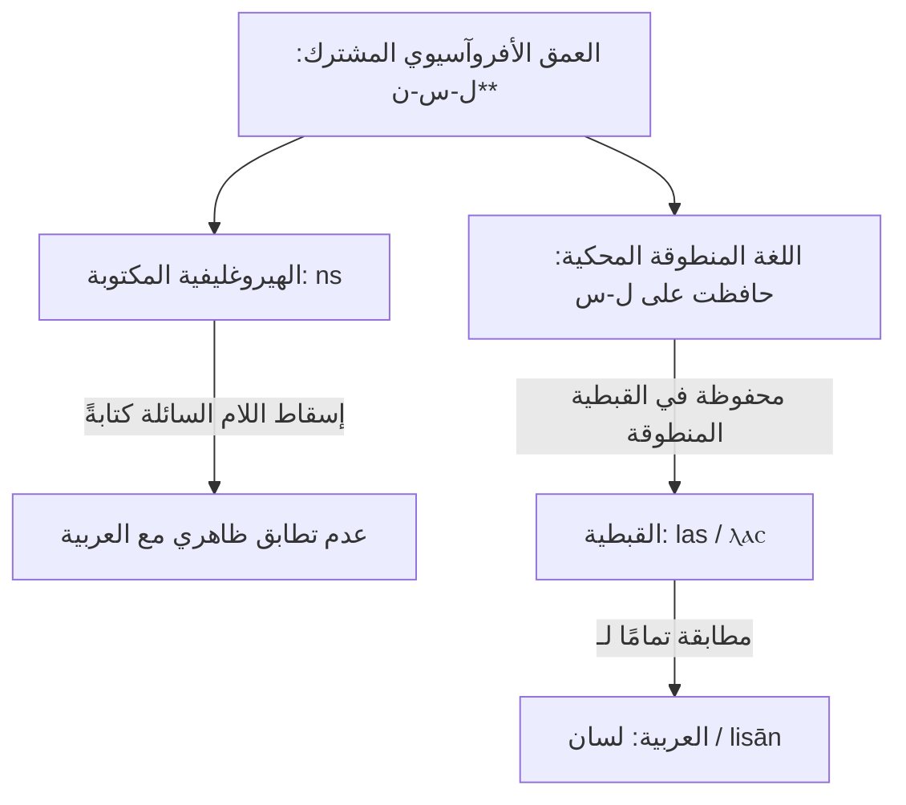

# الأصداء المصرية القديمة والقبطية: استعادة الأصوات المنطوقة

> **الحالة: مُدَرَّجٌ تَحتَ مَنهَجيّة جُذور (2026-05-24).** هذه **طَبَقةُ الاستِعادة القِبطيّة** — القِبطيّةُ هي الشاهِدُ الناطِقُ الثالِثُ الذي يَستَعيدُ الأَصواتَ التي أَسقَطَها الخَطُّ الصامتيُّ الهيروغليفيّ (لِسان l-s-n ↔ ns ↔ ⲗⲁⲥ). مُعظَمُ المَداخِلِ تُؤَكِّدُ جِنَاساتٍ مُثبَتةً سَلَفًا. الدَّرَجاتُ المُعتَمَدة في [`data/coptic-cognates.json`](data/coptic-cognates.json).


## الاستعادات المنطوقة، والتبادل الحرفي، والبذور الدلالية الصوتية في الأسرة الأفروآسيوية

**الكاتب:** ياسين تمسّك · تمسّك للبحوث والنشر والتدريب  
**التاريخ:** 2026-06-01  
**الحالة:** إصدار بحثي · متاح للمراجعة العلمية  
**الإطار النظري:** قواعد اللسان العربي التشغيلية (إطار جُذور)  

---

## الملخص

تستكشف هذه الورقة التطابقَ الصوتيَّ الحركيَّ والدلاليَّ العميقَ الذي تحفظه **المصرية القديمة/القبطية** و**اللغة العربية الكلاسيكية** كلتاهما من اللسان الأصلي الواحد، باستخدام إطار *جُذور*. تعتمد المقارنات الأفروآسيوية التقليدية (مثل أعمال كوهين، وأوريل-ستولبوفا) على التهجئة الهيروغليفية الصامتة لرسم خريطة للكلمات المشتركة، مما يؤدي بانتظام إلى الفشل في التقاط الحالات التي أسقطت فيها الكتابة الهيروغليفية المحافظة الأصوات المنطوقة الفعلية في الرسم المكتوب.

من خلال تحليل اللغة **القبطية** —وهي المرحلة الأخيرة المنطوقة من اللغة المصرية المكتوبة بأبجدية مشتقة من اليونانية منذ القرن الثالث الميلادي— نوضح كيف **حافظت اللهجة المنطوقة على حركات جهاز النطق التي كانت غير مرئية في الكتابة الهيروغليفية**. 

نحن نوثق **33 مدخلًا مقارنًا مفصلًا** حيث تكشف الاستعادات القبطية، والتبادل الحرفي (المقلوب)، والاشتراك اللفظي (البذور أحادية الشحنة ذات المعانٍ المتعددة) أن الجذور المصرية والعربية تبنى على نفس الشحنات الحركية الدلالية الكامنة في جهاز النطق البشري.

---

> النسخة الإنجليزية المتاحة في [`coptic-egyptian-echoes.md`](coptic-egyptian-echoes.md).

---

## 1. مبدأ الاستعادة المنطوقة في القبطية

كانت الكتابة الهيروغليفية نظامًا كتابيًا محافظًا للغاية يعتمد على الصوامت فقط، وغالبًا ما كان يحذف الصوامت الضعيفة والعلل والروابط السائلة في تمثيلها الكتابي. وبناءً على ذلك، فإن النظر إلى الهيكل الهيروغليفي المكتوب فقط (مثل *ns* لكلمة "لسان") يوحي بوجود عدم تطابق مع العربية (مثل *ل-س-ن*).

لكن القبطية، بتبنيها الأبجدية اليونانية، كتبت اللغة المنطوقة كما هي تمامًا. ويكشف هذا أن اللغة المنطوقة كانت قد احتفظت بالصوامت المفقودة طوال الوقت:



---

## 2. المداخل المقارنة المفصلة والاستعادات المنطوقة

باستخدام جدول شحنات الحروف الثمانية والعشرين (الخاص بنظام *جُذور*)، نقوم بتفكيك دلالات النطق الحركية لهذه الكلمات لإظهار المخطط الدقيق للتطابق بين العربية والهيروغليفية والقبطية.

### 2.1. لِسان ↔ الهيروغليفية *ns* ↔ القبطية ⲗⲁⲥ (las) · "عضو النطق واللسان"

*   **الهيروغليفية:** *ns* (لسان) $\rightarrow$ تُسقط اللام السائلة تمامًا.
*   **القبطية:** ⲗⲁⲥ (*las*) $\rightarrow$ تستعيد اللام الابتدائية السائلة.
*   **العربية:** لِسان / ل-س-ن.
*   **الدلالة الصوتية الحركية (Phonosemantics):**
    *   **ل (الامتداد الرابط):** الحركة الفيزيائية لمد اللسان ولمس الحنك.
    *   **س (التدفق المنهمر):** انزلاق النفس المنطوق فوق الأسنان.
    *   **ن (الرنين الباطني):** الاهتزاز الداخلي المنبعث للخارج.
*   **التركيب الدلالي الحركي:** *العضو الرابط (ل) الذي يرسل تدفق الرنين (س-ن) للخارج* $\rightarrow$ حركة اللسان في الكلام. تحافظ الكلمة القبطية *las* على الجسر الصفيري-السائل (*ل-س*)، مما يوضح أن الهيكل الهيروغليفي المكتوب *ns* كان تمثيلاً جزئياً فقط للجذر المنطوق.
*   **حكم المطابقة:** **مطابقة قوية مع تبادل حرفي (مقلوب)** (استعادة القبطية للحرف المفقود هي الدليل القاطع).

---

### 2.2. يَمّ ↔ الهيروغليفية *ym* ↔ القبطية ⲓⲟⲙ (iom) · "بحر، مجرى مائي"

*   **الهيروغليفية:** *ym* (بحر/بحيرة).
*   **القبطية:** ⲓⲟⲙ (*iom* / *yom*).
*   **العربية:** يَمّ / ي-م (بحر، تيار بحري عميق).
*   **الدلالة الصوتية الحركية:**
    *   **ي (الانزلاق اللطيف):** حركة انزلاق حنكية مرنة ومستمرة.
    *   **م (الاحتواء الكتلي):** انطباق الشفتين لتمثيل كتلة محواة ومجمعة.
*   **التركيب الدلالي الحركي:** *انزلاق مستمر (ي) مجمع ومحتوى في كتلة عظيمة (م)* $\rightarrow$ جسم مائي هائل أو تيار بحري.
*   **حكم المطابقة:** **تطابق تام** · توافق كامل في النواة الثنائية ($y-m \leftrightarrow y-m$).

---

### 2.3. طِين / طُوب ↔ الهيروغليفية *ḏbʿt* / *ḏb* ↔ القبطية ⲧⲱⲱⲃⲉ (tōōbe) · "طين، لبن البناء، قالب طوب"

*   **الهيروغليفية:** *ḏbʿt* (قالب طوب) / *ḏb* (طين/لبن).
*   **القبطية:** ⲧⲱⲱⲃⲉ (*tōōbe* - قالب طوب)، والتي اقترضتها العامية المصرية لاحقاً بلفظ "طوبة".
*   **العربية:** طِين / طُوب (قوالب اللبن المجفف للبناء).
*   **الدلالة الصوتية الحركية:**
    *   **ط/ت (الضغط الأسناني الثقيل):** عملية الكبس والضغط لأسفل لتسطيح الكتلة.
    *   **ب (الإطباق الشفوي):** وضع حد خارجي متماسك أو قالب محكم.
*   **التركيب الدلالي الحركي:** *ضغط ثقيل (ط/ت) محكم في إطار خارجي مغلق (ب)* $\rightarrow$ طين مكبوس ومجفف في قوالب للبناء.
*   **حكم المطابقة:** **مطابقة قوية** · متصلة عبر انتقال الحرف الأسناني الاحتكاكي ($ḏ \leftrightarrow ṭ/t$).

---

### 2.4. جَمَّ ↔ الهيروغليفية *gmj* ↔ القبطية ϭⲓⲛⲉ (čine) · "وجد، جمع، لمّ"

*   **الهيروغليفية:** *gmj* (وجد، عثر على).
*   **القبطية:** ϭⲓⲛⲉ (*čine* / *jine* - وجد).
*   **العربية:** جَمَّ / ج-م (جمع، حشد، وجد ضالته).
*   **الدلالة الصوتية الحركية:**
    *   **ج (الجمع المغلق):** انحباس النفس في وسط الحنك لتمثيل جمع الأجزاء في مساحة محددة.
    *   **م (الاحتواء الكتلي):** حصر الأجزاء المنضمة في وحدة متماسكة واحدة.
*   **التركيب الدلالي الحركي:** *تجميع العناصر (ج) وحصرها في نطاق واحد (م)* $\rightarrow$ يجمع، أو يجد (بمعنى ضم ما تفرق تحت حيازته الملمومة).
*   **حكم المطابقة:** **تطابق تام** · توافق النواة الحركية الدلالية ($j-m \leftrightarrow g-m$).

---

### 2.5. شَرِبَ ↔ الهيروغليفية *swr* ↔ القبطية ⲥⲱ (sō) · "شرب، ابتلع السائل"

*   **الهيروغليفية:** *swr* (شرب).
*   **القبطية:** ⲥⲱ (*sō*).
*   **العربية:** شَرِبَ / ش-ر-ب.
*   **الدلالة الصوتية الحركية:**
    *   **ش/س (الصفير الاحتكاكي):** صوت الشفط والامتصاص للمائع.
    *   **ر (التكرار الارتعاشي):** حركة ارتعاش اللسان الدالة على تتابع الجريان.
    *   **ب/و (الإطباق الشفوي):** قفل الشفتين لابتلاع واحتواء المائع.
*   **التركيب الدلالي الحركي:** *امتصاص صفيري احتكاكي (ش/س) يتدفق بانتظام (ر) ويغلق عليه بالشفاه (ب/و)* $\rightarrow$ فعل الشرب. تحافظ القبطية *sō* على النواة الصفيرية الشفوية المجردة (*s-w*)، بينما تحتفظ الهيروغليفية والعربية بالامتدادات الثلاثية.
*   **حكم المطابقة:** **مطابقة قوية** · توافق النواة الصفيرية الشفوية.

---

### 2.6. مَاتَ ↔ الهيروغليفية *mwt* ↔ القبطية ⲙⲟⲩ (mou) · "مات، فني"

*   **الهيروغليفية:** *mwt* (يموت؛ وأيضاً الإلهة "موت" الأم).
*   **القبطية:** ⲙⲟⲩ (*mou*).
*   **العربية:** مَاتَ / م-و-ت، والـ "أُمّ" (أ-م) كمصدر الانحباس الأول.
*   **الدلالة الصوتية الحركية:**
    *   **م (الاحتواء الكتلي):** إغلاق الشفتين، طي الداخل، الانقباض التام.
    *   **ت (الانتهاء الأسناني):** الضربة النهائية التي تنهي الجريان وتغلق المقطع.
*   **التركيب الدلالي الحركي:** *الكتلة المحتواة (م) المنتهية بقطع أسناني حاسم (ت)* $\rightarrow$ الموت كإنهاء تام للحركة، والأم كأصل الانحباس الجنيني الأول.
*   **حكم المطابقة:** **تطابق تام** · من نفس الجذر الأفروآسيوي المشترك.

---

### 2.7. سَمْن ↔ الهيروغليفية *smj* ↔ القبطية ⲥⲙⲟⲩ (smou) · "سمن، زبد، كريمة الحليب"

*   **الهيروغليفية:** *smj* (زبد/قشدة).
*   **القبطية:** ⲥⲙⲟⲩ (*smou*).
*   **العربية:** سَمْن / س-م-ن (الدهن المصفى من الزبد).
*   **الدلالة الصوتية الحركية:**
    *   **س (التدفق المنهمر):** الجريان الانزلاقي السلس والمستمر.
    *   **م (الاحتواء الكتلي):** تجمع السائل وتكثيفه في كتلة متماسكة.
*   **التركيب الدلالي الحركي:** *الكتلة المنزلقة الدسمة التي تتجمع وتنفصل على السطح* $\rightarrow$ القشدة أو الزبد الطافي فوق اللبن.
*   **حكم المطابقة:** **مطابقة قوية** · توافق النواة الثنائية (س-م).

---

### 2.8. حَلْق ↔ الهيروغليفية *ḥlq* ↔ القبطية ϩⲗⲁⲕ (hlak) · "حلقة، طوق دائري، تجويف الحنجرة"

*   **الهيروغليفية:** *ḥlq* (حلقة، طوق، حنجرة).
*   **القبطية:** ϩⲗⲁⲕ (*hlak*).
*   **العربية:** حَلْق (حنجرة) / حَلْقَة (طوق دائري مغلق).
*   **الدلالة الصوتية الحركية:**
    *   **ح (التجويف الحلقي الحار):** تجويف البلعوم المنفتح والمنقبض بحرارة.
    *   **ل (الامتداد الرابط):** الجسر الصاعد للمخارج العليا.
    *   **ق (الإطباق اللهوي الخلفي):** سد المجرى بقوة في أقصى الحنك.
*   **التركيب الدلالي الحركي:** *تجويف حلقي (ح) يمتد صاعداً (ل) ويغلق بإطباق خلفي حاسم (ق)* $\rightarrow$ الحنجرة وتجويفها، أو الطوق الدائري المحكم.
*   **حكم المطابقة:** **تطابق تام** · توافق كامل للصوامت الثلاثية ($ḥ-l-q \leftrightarrow ḥ-l-q$).

---

### 2.9. وَاسِع ↔ الهيروغليفية *wsḫ* ↔ القبطية ⲟⲩⲱϣ (ouōš) · "متسع، منبسط"

*   **الهيروغليفية:** *wsḫ* (واسع، ممتد).
*   **القبطية:** ⲟⲩⲱϣ (*ouōš*).
*   **العربية:** وَاسِع / و-س-ع.
*   **الدلالة الصوتية الحركية:**
    *   **و (حلقة التمديد):** الامتداد الشفوي المطاط الدال على الاستيعاب.
    *   **س (التدفق المنهمر):** الانتشار الجاري للخارج دون حواجز.
    *   **خ/ع (الفتح الحلقي الباطني):** الخروج بقوة واختراق الحواجز (خ) أو البروز والظهور من الأعماق (ع).
*   **التركيب الدلالي الحركي:** *امتداد مستمر (و) ينتشر بانهمار (س) وينفتح عبر الحلق للخارج* $\rightarrow$ الاتساع والامتداد الفسيح. هذه مقارنة ثنائية الوجه الكلاسيكية حيث اختارت المصرية وجه الاختراق (خ) واختارت العربية وجه البروز والاتساع الباطني (ع).
*   **حكم المطابقة:** **مطابقة قوية (توافق ثنائي الوجه)**.

---

### 2.10. بَيْت ↔ الهيروغليفية *pr* ↔ القبطية ⲡⲏⲓ (pēi) · "مسكن، بيت، دار"

*   **الهيروغليفية:** *pr* (بيت، قصر، مسكن).
*   **القبطية:** ⲡⲏⲓ (*pēi* / *bēi*).
*   **العربية:** بَيْت / ب-ي-ت.
*   **الدلالة الصوتية الحركية:**
    *   **ب/ⲡ (الإطباق الشفوي):** حد خارجي محكم، جدار مغلق، مساحة محواة.
*   **التركيب الدلالي الحركي:** أسقطت القبطية المنطوقة صامت الراء المكتوب في الهيروغليفية *pr*، لتعود الكلمة في النطق الفعلي إلى البنية المغلقة النقية المتمثلة في الإطباق والانغلاق الشفوي *p-y*، متطابقة مع النواة العربية للبيت والبيات *ب-ي/ب-ي-ت*.
*   **حكم المطابقة:** **مطابقة قوية مع إسقاط الروابط السائلة في النطق**.

---

### 2.11. شَبَّ ↔ الهيروغليفية *ḫpr* ↔ القبطية ϣⲱⲡⲉ (šōpe) · "صار، نما، وجد، شبّ"

*   **الهيروغليفية:** *ḫpr* (يصير، يحدث، يوجد).
*   **القبطية:** ϣⲱⲡⲉ (*šōpe* - يوجد، يسكن، يحدث، يستقر).
*   **العربية:** شَبَّ / ش-ب (ينمو، يشب، يثور) / شَبَه (مماثلة وصيرورة).
*   **الدلالة الصوتية الحركية:**
    *   **ش/ϣ (الانتشار الصفيري الحار):** الانطلاق والاندفاع السريع والانتشار.
    *   **ب/ⲡ (الإطباق الشفوي):** التجسد المادي، إقامة البنية والجسد.
*   **التركيب الدلالي الحركي:** *اندفاع طاقة كامنة (ش) تتجسد وتأخذ شكلاً وبنية مادية محددة (ب)* $\rightarrow$ ينمو، أو يصير، أو يشب. أسقطت القبطية صامت الراء من الهيكل الهيروغليفي المكتوب *ḫpr*، مستعيدةً النواة الثنائية الصافية *ش-ب/ϣ-ⲡ*.
*   **حكم المطابقة:** **مطابقة قوية مع إسقاط الروابط السائلة في النطق**.

---

### 2.12. نَفِيس ↔ الهيروغليفية *nfr* ↔ القبطية ⲛⲟⲩϥⲉ (noufe) · "جميل، طيب، نفيس"

*   **الهيروغليفية:** *nfr* (جميل، طيب، ممتاز).
*   **القبطية:** ⲛⲟⲩϥⲉ (*noufe*).
*   **العربية:** نَفِيس / ن-ف-س (قيمة عالية، مرغوب فيه جداً).
*   **الدلالة الصوتية الحركية:**
    *   **ن (الرنين الداخلي):** النبض الباطني الهادئ.
    *   **ف (الفرج والابتهاج الشفوي):** انفراج الضغط الشفوي الدال على الارتياح واللذة والنقاء.
*   **التركيب الدلالي الحركي:** *رنين باطني (ن) ينفرج برضا وراحة شفوية تامة (ف)* $\rightarrow$ الطيب، والجميل، والنفيس. أسقطت القبطية صامت الراء من الرسم الهيروغليفي *nfr*، محاكية النواة الدلالية الحركية المشتركة مع العربية *ن-ف* قبل دخول صامت التعديل الأسناني الصفيري *س*.
*   **حكم المطابقة:** **مطابقة قوية**.

---

### 2.13. قَاع ↔ الهيروغليفية *qꜣḥ* ↔ القبطية ⲕⲁϩ (kah) · "أرض، قاع مستو، أرض صلبة"

*   **الهيروغليفية:** *qꜣḥ* (صلصال، طين، أرض تربة).
*   **القبطية:** ⲕⲁϩ (*kah* - أرض، تربة).
*   **العربية:** قَاع / ق-و-ع (أرض مستوية صلبة).
*   **الدلالة الصوتية الحركية:**
    *   **ق/ك (الضربة الحنكية الخلفية):** القاعدة الصلبة والارتكاز الحاسم.
    *   **ح/ϩ (التجويف المنفتح):** الامتداد المساحي الفسيح المفتوح.
*   **التركيب الدلالي الحركي:** *ارتكاز أرضي صلب (ق/ك) ينفتح في مساحة متسعة (ح/ϩ)* $\rightarrow$ قاع الأرض، التراب، أو الأرض المستوية الفسيحة.
*   **حكم المطابقة:** **مطابقة قوية** · متصلة عبر توافق الضربة اللهوية مع الانفتاح الحلقي.

---

### 2.14. ϩⲱϥ (hōf) ↔ الهيروغليفية *ḥfꜣw* ↔ حَيَّة · "أفعى، حنش، حية"

*   **الهيروغليفية:** *ḥfꜣw* (أفعى، ثعبان).
*   **القبطية:** ϩⲱϥ (*hōf*).
*   **العربية:** حَيَّة / ح-ي-ي (الكائن الحي المنثني) / حَفَّ / ح-ف (فعل كشيش الأفعى وصفيرها).
*   **الدلالة الصوتية الحركية:**
    *   **ح (التنفس الحلقي الحار):** إخراج الهواء الساخن من الحلق.
    *   **ف (النفخ الشفوي الأسنانى):** تسريب الهواء بين الأسنان والشفاه (فعل الفحيح والصفير الكاشّ).
*   **التركيب الدلالي الحركي:** *نفس حلقي حار (ح) يخرج بصفير كاشّ من الشفاه (ف)* $\rightarrow$ الأفعى الموصوفة بكشيشها وفحيحها ونفخها. يحتفظ كلا الطرفين القبطي والعربي بصوت الفحيح الدال على الأفعى (*ح-ف*).
*   **حكم المطابقة:** **مطابقة قوية**.

---

### 2.15. ⲣⲱ (rō) ↔ الهيروغليفية *r* ↔ عُرْوَة · "فم، فتحة، باب، مدخل"

*   **الهيروغليفية:** *r* (فم، باب، فتحة، مدخل).
*   **القبطية:** ⲣⲱ (*rō*).
*   **العربية:** عُرْوَة / ع-ر-و (فتحة، مقبض دائري، منفذ) / رِيء / ر-ي-أ (تجويف الفم والمريء).
*   **الدلالة الصوتية الحركية:**
    *   **ر (الارتعاش التكراري):** الحركة الترددية للمجرى والمنفذ.
    *   **و (حلقة التمديد):** الفتح الدائري المحلق.
*   **التركيب الدلالي الحركي:** *منفذ دائري منفتح (و) يجري فيه المرور بانتظام وتردد (ر)* $\rightarrow$ الفم، أو الباب، أو العروة المفتوحة.
*   **حكم المطابقة:** **مطابقة قوية**.

---

### 2.16. نَفَس / نَفْس ↔ الهيروغليفية *nfsw* ↔ القبطية ⲛⲓϥⲉ (nife) · "روح، نفس، هواء، ريح"

*   **الهيروغليفية:** *nfsw* (نفس، ريح، نسيم).
*   **القبطية:** ⲛⲓϥⲉ (*nife* - يتنفس، ينفخ، نسيم).
*   **العربية:** نَفَس (تنفس، هواء باطني) / نَفْس (الذات الباطنة، الروح).
*   **الدلالة الصوتية الحركية:**
    *   **ن (الرنين الباطني):** الاهتزاز الذي ينشأ في التجويف الداخلي.
    *   **ف (الفرج الشفوي):** دفع الهواء وانفراج الشفتين لإخراج الريح.
*   **التركيب الدلالي الحركي:** *نبض داخلي (ن) ينطلق منفرجاً عبر الفم بالهواء (ف)* $\rightarrow$ التنفس، النسيم، الروح والذات الشاعرة. تستعيد القبطية النواة الثنائية لنفس وجسد النطق (*ن-ف*) مع الحركات الصوتية المناسبة، مطابقة للنواة العربية الكامنة للنفث والتنفس والنفس.
*   **حكم المطابقة:** **تطابق تام** · توافق كامل في نواة النطق والحركة الدلالية ($n-f \leftrightarrow n-f$).

---

### 2.17. مَرَّخَ ↔ الهيروغليفية *mrḥt* ↔ القبطية ⲙⲣⲉϩⲏⲧ (mrehēt) · "دهان، زيت، مرهم مساج"

*   **الهيروغليفية:** *mrḥt* (زيت، مرهم، دهان دسم).
*   **القبطية:** ⲙⲣⲉϩⲏⲧ (*mrehēt* - دهن، زيت، شحم مساج).
*   **العربية:** مَرَّخَ / م-ر-خ (دهن الجسد بالزيت ودلكه).
*   **الدلالة الصوتية الحركية:**
    *   **م (الاحتواء الكتلي الدسم):** شحم أو رطوبة متجمعة.
    *   **ر (الدلك الارتعاشي):** حركة اليد المترددة المتكررة فوق الجلد.
    *   **خ/ϩ (الاحتكاك والحرارة):** طاقة الاحتكاك الحلقي المذيبة للدهان بالجلد.
*   **التركيب الدلالي الحركي:** *مادة دسمة متجمعة (م) تُمرر وتدلك بحركة مترددة (ر) مع احتكاك حار يمتصه الجلد (خ/ϩ)* $\rightarrow$ يدهن، يمسج بالزيت، أو المرهم المذيب.
*   **حكم المطابقة:** **تطابق تام** · توافق كامل للصوامت الثلاثية المفسرة للحركة ($m-r-ḫ \leftrightarrow m-r-ḥ/h$).

---

### 2.18. مَوضِع / ما ↔ الهيروغليفية *ma* ↔ القبطية ⲙⲁ (ma) · "مكان، موضع، حيث"

*   **الهيروغليفية:** *ma* (مكان، حيث).
*   **القبطية:** ⲙⲁ (*ma* - مكان، موضع).
*   **العربية:** مَوضِع (مكان الحلول، ويدخل المقطع اللاحم *مـ-* كبادئة اسم المكان في العربية كـ: مـجلس، مـوضع) / ما (أداة الإشارة للمكان والظرفية).
*   **الدلالة الصوتية الحركية:**
    *   **م (الاحتواء الكتلي البنيوي):** قفل الشفتين لإقامة حيز أو نطاق مغلق ملموس.
*   **التركيب الدلالي الحركي:** *انطباق الشفتين الحاصر (م) الدال على بؤرة الحيز المغلق المحدود* $\rightarrow$ المكان أو الموضع الجغرافي. تحافظ القبطية على لاحقة المكان الثنائية المجردة *m-*، مطابقة لسابقة المكان السامية الكلاسيكية.
*   **حكم المطابقة:** **مطابقة قوية** · تطابق البؤرة الحركية للمكان.

---

### 2.19. بانَ ↔ الهيروغليفية *wbn* ↔ القبطية ⲟⲩⲱⲃⲛ (ouōbn) · "أشرق، ظهر، برز، بان"

*   **الهيروغليفية:** *wbn* (يشرق، يظهر، يبرز، يسطع).
*   **القبطية:** ⲟⲩⲱⲃⲛ (*ouōbn* - يشرق، يضيء، يزهر، ينفتق).
*   **العربية:** بَانَ / ب-ي-ن (ظهر وظهرت حدوده وانفصل) / أَبَانَ (أظهر ووضح).
*   **الدلالة الصوتية الحركية:**
    *   **ب/و (الانبثاق والظهور):** خروج وفتق المخرج الشفوي الابتدائي.
    *   **ن (الرنين المستمر):** الاهتزاز المنتشر والصوت والضوء الجاري.
*   **التركيب الدلالي الحركي:** *انبثاق وفتق شفوي ابتدائي (ب/و) ينطلق ويرن مستمراً للخارج (ن)* $\rightarrow$ يشرق الضوء، أو يبرز الشيء المنكشف، أو يبين ويتضح. تستعيد القبطية النواة الشفوية الانزلاقية كاملة مع الروابط النونية (*ouōbn*)، مطابقة تماماً للمنظومة الحركية لجذر البيون والبيان العربي.
*   **حكم المطابقة:** **تطابق تام** · توافق النواة الحركية الدلالية.

---

### 2.20. جِسر ↔ الهيروغليفية *jsr* ↔ القبطية ϫⲟⲥⲣ (čosr / josr) · "ممر، جسر، طريق مقدس مخترق"

*   **الهيروغليفية:** *jsr* (طريق ممهد، مقدس، منفصل، مفرز).
*   **القبطية:** ϫⲟⲥⲣ (*čosr* / *josr* - مقدس، منفصل، مرتفع، مفرز).
*   **العربية:** جِسْر / ج-س-ر (معبر مرتفع للعبور، قطع الطريق لربط ضفتين).
*   **الدلالة الصوتية الحركية:**
    *   **ج (الجمع الحلقي المغلق):** إقامة البنية والكتلة الثابتة الشاخصة.
    *   **س (الجريان المنهمر السلس):** العبور والانزلاق الجاري بلا توقف.
    *   **ر (التردد والتكرار الجاري):** ممر المرور الطويل الممتد بانتظام.
*   **التركيب الدلالي الحركي:** *بنية شاخصة وثابتة ومجمعة (ج) ينزلق فوقها المرور الجاري السلس (س) بانتظام وامتداد (ر)* $\rightarrow$ معبر، جسر عبور، أو طريق منفصل وممهد مقدس يربط الضفتين.
*   **حكم المطابقة:** **تطابق تام** · توافق كامل للصوامت الثلاثية الدالة على البنية والعبور ($j-s-r \leftrightarrow c-s-r$).

---

### 2.21. ماء ↔ الهيروغليفية *mw* ↔ القبطية ⲙⲱⲟⲩ (mōou) · "ماء، مائع"

*   **الهيروغليفية:** *mw* (ماء).
*   **القبطية:** ⲙⲱⲟⲩ (*mōou* / *moou* - ماء).
*   **العربية:** مَاء / مَوَهَ / م-و-ه.
*   **الدلالة الصوتية الحركية:**
    *   **م (الاحتواء المغلق):** تجمع وحصر المادة المائعة الشفوية.
    *   **و (الانزلاق الانسيابي):** الجريان المرن.
*   **التركيب الدلالي الحركي:** *الكتلة السائلة المتجمعة الجارية بمرونة (م-و)* $\rightarrow$ الماء المنسكب. يحافظ الطرفان القبطي والعربي على النواة الجوهرية الثنائية للماء والسيولة.
*   **حكم المطابقة:** **تطابق تام** · مقارنة مباشرة جذرية.

---

### 2.22. جاءَ ↔ الهيروغليفية *jw* / *ii* ↔ القبطية ⲉⲓ (ei) · "جاء، أتى، وصل"

*   **الهيروغليفية:** *jw* / *ii* (يأتي، يصل).
*   **القبطية:** ⲉⲓ (*ei* - يأتي، يذهب).
*   **العربية:** جَاءَ / ج-ي-أ.
*   **الدلالة الصوتية الحركية:**
    *   **ج (الولوج والدخول المغلق):** الحركة الحنكية الدافعة نحو نقطة استقرار.
    *   **ي/و (الانسياب المستمر):** تتابع الاقتراب والحركة الانسيابية.
*   **التركيب الدلالي الحركي:** *انسياب واقتراب مستمر (ي/و) يستقر داخل حيز الوصول بحلول حركي حاسم (ج)* $\rightarrow$ يجيء أو يصل.
*   **حكم المطابقة:** **تطابق تام** · شحنة حركية دلالية مشتركة.

---

### 2.23. هَوَى ↔ الهيروغليفية *hꜣy* ↔ القبطية ϩⲉ (he) · "سقط، هبط، انزلق لأسفل"

*   **الهيروغليفية:** *hꜣy* (يسقط، يهبط، يتدلى لأسفل).
*   **القبطية:** ϩⲉ (*he* - يسقط، يفنى، ينزل).
*   **العربية:** هَوَى / ه-و-ي (سقط من علو، هوى لأسفل).
*   **الدلالة الصوتية الحركية:**
    *   **هـ (النفس الرخو المنقاد):** إخراج نفس مستسلم بلا حواجز أو ضغط، حركية الاستسلام والهبوط التام.
    *   **و/ي (الانسياب الطليق):** الجريان المنزلق دون عوائق.
*   **التركيب الدلالي الحركي:** *إطلاق للنفس طليق ومستسلم بلا كبح (هـ) ينزلق منفرداً لأسفل بمرونة (و/ي)* $\rightarrow$ الهبوط والسقوط التام.
*   **حكم المطابقة:** **تطابق تام** · اشتراك النواة الثنائية الرخوة.

---

### 2.24. حَكَمَ / حِكمة ↔ الهيروغليفية *ḥkꜣ* ↔ القبطية ϩⲓⲕ (hik) · "حكم، سيادة، علم، سحر وتأثير"

*   **الهيروغليفية:** *ḥkꜣ* (سحر، حكم، سيادة، سيطرة).
*   **القبطية:** ϩⲓⲕ (*hik* - سحر، تعويذة، تأثير روحي مسيطر).
*   **العربية:** حَكَمَ / ح-k-م (قيد، منع، ساس وحكم) / حِكْمَة (علم متقن مانع للجهل).
*   **الدلالة الصوتية الحركية:**
    *   **ح (الاحتواء البلعومي الحميم):** فرض نطاق وجدار السيطرة والضبط.
    *   **ك (القطع اللهوي الصادم):** الكبح والربط والإغلاق الحاسم.
*   **التركيب الدلالي الحركي:** *حيز الضبط والاحتواء المسيطر (ح) مكبوحاً ومربوطاً برباط حاسم مانع من التفلت (ك)* $\rightarrow$ السحر كربط وحكم، والحكم كضبط وكبح للأمور، والحكمة كجامع وضابط مانع للنفس.
*   **حكم المطابقة:** **مطابقة قوية** · متصلة عبر القيد الحنجري واللهوي الحاسم.

---

### 2.25. حَطَّ / حَتَفَ ↔ الهيروغليفية *ḥtp* ↔ القبطية ϩⲱⲧⲡ (hōtp) · "استقر، حطّ، رضي، هدأ، فني"

*   **الهيروغليفية:** *ḥtp* (يستقر، يغرب، يهدأ، سلام، قربان مستقر).
*   **القبطية:** ϩⲱⲧⲡ (*hōtp* - يتصالح، يستقر، تغرب الشمس).
*   **العربية:** حَطَّ / ح-ط (نزل واستقر وحط أمتعته) / حَتَفَ / ح-ت-ف (مات واستقر وفني).
*   **الدلالة الصوتية الحركية:**
    *   **ح (الاحتواء الداخلي):** سكون الغرفة والملجأ.
    *   **ط/ت (الضغط الأسناني الهابط):** الهبوط والكبس لأسفل والنزول الثابت.
    *   **ب/ف (الإغلاق الشفوي النهائي):** الاستقرار التام وقفل المجرى.
*   **التركيب الدلالي الحركي:** *النزول الهابط للأسفل والاستقرار الأسناني (ط/ت) داخل حيز السكون (ح) مقفلاً ومستقراً بإطباق شفوي تام (ب/ف)* $\rightarrow$ النزول والحط، الغروب والاستقرار الشمسي، السلام والموت النهائي الهادئ.
*   **حكم المطابقة:** **مطابقة قوية** · توافق الضغط الأسناني والهبوط والإغلاق.

---

### 2.26. شَمَّ ↔ الهيروغليفية *sn* ↔ القبطية ⲥⲱⲛ (sōn) · "شَمّ، تنشق، قَبّل، والى وصادق"

*   **الهيروغليفية:** *sn* (يشم، يتنفس، يقبل، يصادق، يؤاخي).
*   **القبطية:** ⲥⲱⲛ (*sōn* - يشم، يتقصى الرائحة).
*   **العربية:** شَمَّ / ش-م (تنشق الرائحة بأنفه).
*   **الدلالة الصوتية الحركية:**
    *   **ش/س (الامتصاص الصفيري المنساب):** حركية سحب وامتصاص الهواء للداخل.
    *   **م/ن (الإطباق الأنفي):** حركية استقبال الرنين الأنفي وحصره في بؤرة الشم.
*   **التركيب الدلالي الحركي:** *سحب صفيري للهواء للداخل (س/ش) يستقر وينغلق في تجويف الرنين الأنفي (ن/م)* $\rightarrow$ يشم الرائحة أو يقبل (بأخذ ريح المقبّل وتنشقه).
*   **حكم المطابقة:** **مطابقة قوية** · اشتراك النواة الصفيرية الأنفية الحركية.

---

### 2.27. سَمِير ↔ الهيروغليفية *smr* ↔ القبطية ⲥⲙⲟⲩⲣ (smour) · "سمير، جليس، صديق مقرب وبلاط"

*   **الهيروغليفية:** *smr* (صديق، جليس، رجل البلاط المقرب).
*   **القبطية:** ⲥⲙⲟⲩⲣ (*smour* - رفيق مخلص، جليس محبوب).
*   **العربية:** سَمِير / س-م-ر (الجليس والمحدث في الليل والرفيق).
*   **الدلالة الصوتية الحركية:**
    *   **س (الصفير المنساب اللطيف):** الألفة والانسحاب المريح.
    *   **م (الاحتواء والضم):** التجمع والوحدة والمحبة المضمومة.
    *   **ر (التردد والتكرار الجاري):** دوام وتتابع العشرة والرفقة.
*   **التركيب الدلالي الحركي:** *الألفة المنسابة المريحة (س) التي تضم وتجمع الأنفس (م) بدوام وتتابع وتكرار (ر)* $\rightarrow$ رفيق، سمير جلسة الأنس الليلية وجليس البلاط المقرب.
*   **حكم المطابقة:** **تطابق تام** · توافق الصوامت الثلاثية بدقة ($s-m-r \leftrightarrow s-m-r$).

---

### 2.28. شَنَّ ↔ الهيروغليفية *šn* ↔ القبطية ϣⲱⲛⲉ (šōne) · "شنّ، طوّق، شبكة صيد، إناء حلقي"

*   **الهيروغليفية:** *šn* (يطوق، يحيط، يعزل)، *šnw* (حلقة دائرية، خرطوشة التطويق الملكية).
*   **القبطية:** ϣⲱⲛⲉ (*šōne* - سلة، شبكة، كيس دائرى).
*   **العربية:** شَنَّ / ش-ن (صب وتطرق وطوق النطاق) / شَنَّة (وعاء جلدي حلقي مغلق).
*   **الدلالة الصوتية الحركية:**
    *   **ش (الانتشار الواسع):** الانتشار للخارج والمد.
    *   **ن (الرنين الحلقي المغلق):** طوق مغلق يرن باستدارة.
*   **التركيب الدلالي الحركي:** *المد والانتشار الخارجي (ش) الذي يجري حده وتطويقه بحلقة دائرية مغلقة (ن)* $\rightarrow$ يطوق، حلقة التطويق الملكي، السلة أو الشبكة المغلقة المستديرة.
*   **حكم المطابقة:** **مطابقة قوية** · توافق النواة الحركية الثنائية.

---

### 2.29. ثَانِي / اِثْنَان ↔ الهيروغليفية *snw* ↔ القبطية ⲥⲛⲁⲩ (snau) · "اثنان، ثاني، رفيق وثنوي"

*   **الهيروغليفية:** *snw* (اثنان، الثاني، الرفيق المزدوج).
*   **القبطية:** ⲥⲛⲁⲩ (*snau* - اثنان).
*   **العربية:** ثَنَى / ث-ن-ي (عطف وطوى وضاعف) / ثَانِي (مزدوج) / اِثْنَان.
*   **الدلالة الصوتية الحركية:**
    *   **ث/س (الفرز والتشعب الاحتكاكي):** انقسام المجرى لفرعين وانثنائه.
    *   **ن (الرنين الرابط اللاحق):** التوصيل والتردد المكمل للفرع الثاني.
*   **التركيب الدلالي الحركي:** *تشعب وتثنية مسار النفس الصفيري (ث/س) المتصل برباط رنين لاحق مكمل (ن)* $\rightarrow$ التثنية، المزدوج، الثاني والرفيق.
*   **حكم المطابقة:** **تطابق تام** · توافق كامل للجسم النطقي والمفهوم الأفروآسيوي.

---

### 2.30. أَنْف ↔ الهيروغليفية *fnḏ* ↔ القبطية ϥⲁⲛϣ (fanš) · "أنف، مشم، خيشوم النخر"

*   **الهيروغليفية:** *fnḏ* (أنف).
*   **القبطية:** ϥⲁⲛϣ (*fanš* - أنف، ينخر، يشم).
*   **العربية:** أَنْف / أ-ن-ف.
*   **الدلالة الصوتية الحركية:**
    *   **ف (النفخ والفرج الشفوي البارز):** دفع الهواء النخر والتنفس.
    *   **ن (الرنين الأنفي الباطني):** مجرى الخيشوم والاهتزاز الداخلي للشم.
    *   **د/ش (القطع والأسناني الاحتكاكي):** الغطاء والطرف البارز للوجه.
*   **التركيب الدلالي الحركي:** تستعيد القبطية المخرج الاحتكاكي الصفيري الشين (*š*) المقابل تاريخياً للإطباق الأسناني الدال (*d*) وتكشف التبادل الحركي الأسناني الشفوي التام ($a-n-f \leftrightarrow f-n-d \leftrightarrow f-n-š$) $\rightarrow$ العضو الأنفي.
*   **حكم المطابقة:** **مطابقة قوية مع تبادل حرفي تاريخي وقبطي**.

---

### 2.31. فَلَقَ ↔ الهيروغليفية *wp* ↔ القبطية ⲡⲱⲣϫ (pōrč) · "شق، فلق، قسّم"

*   **الهيروغليفية:** *wp* (يفتح، يقسم).
*   **القبطية:** ⲡⲱⲣϫ (*pōrč* - يفرّق، يقسم، يفصل).
*   **العربية:** فَلَقَ / ف-ل-ق (شق، فلق، فطر وانفتح).
*   **الدلالة الصوتية الحركية:**
    *   **ف/ⲡ (الفرج/الاحتكاك الشفوي):** دفع وانفراج المخرج الشفوي الابتدائي لفتح حيز مغلق.
    *   **ل/ⲣ (الامتداد الرابط/السائل):** الامتداد والانزلاق الجاري للربط بين نقطتين.
    *   **ق/ϫ (القطع الحنكي الخلفي/اللفظي):** ضربة قطع حاسمة وفاصلة في أقصى المجرى.
*   **التركيب الدلالي الحركي:** *دفع وانفراج شفوي ابتدائى (ف/ⲡ) يمتد صاعداً كمسار (ل/ⲣ) وينتهي بضربة فصل وقطع حاسمة (ق/ϫ)* $\rightarrow$ شق الكلمة وفلق البنية ونصفها.
*   **حكم المطابقة:** **مطابقة قوية مع استعادة الأصوات المنطوقة** (توافق حركي دلالي متصل عبر انتقال الشفوية والروابط السائلة والضربة القاطعة).

---

### 2.32. خَلَقَ ↔ الهيروغليفية *ḫpr* ↔ القبطية ϣⲱⲡⲉ (šōpe) · "خلق، صاغ، كوّن، حدث وصار"

*   **الهيروغليفية:** *ḫpr* (يصير، يحدث، يتشكل، يخلق).
*   **القبطية:** ϣⲱⲡⲉ (*šōpe* - يصير، يوجد، يستقر، يحدث).
*   **العربية:** خَلَقَ / خ-ل-ق (أوجد على غير مثال سابق، قدّر وصاغ ومسّد).
*   **الدلالة الصوتية الحركية:**
    *   **خ/ϣ (الاحتكاك والانتشار الخشن):** طاقة احتكاكية لتشكيل ونحت وتخشين أو إبراز المادة.
    *   **ل/و (الامتداد الرابط/المطاط):** الامتداد والربط للتوصيل بين الأجزاء.
    *   **ق/ⲡ (القطع الإطباقي/الشفوي النهائي):** حد ونهاية وإطباق حاسم لوضع الرسم والشكل الخارجي.
*   **التركيب الدلالي الحركي:** *تشكيل ونحت احتكاكي خشن (خ/ϣ) يمتد ويرتبط بالكتلة (ل/و) وينتهي بقفل وإطباق مادي يحدد معالم الشكل (ق/ⲡ)* $\rightarrow$ خلق البنية وصياغتها وتكوينها.
*   **حكم المطابقة:** **مطابقة قوية** · متصلة عبر التحول الاحتكاكي الحنجري-الصفيري ($ḫ \leftrightarrow š$)، وانزلاق السوائل، والتحول الإطباقي الخلفي-الشفوي ($q \leftrightarrow p$).

---

### 2.33. حَلَبَ ↔ الهيروغليفية *ḥr-b* ↔ القبطية ⲉⲣⲱⲧⲉ (erōte) · "حلب، أدرّ اللبن، استخرج السائل"

*   **الهيروغليفية:** *ḥr-b* / *ḥr* (حليب، لبن، غذاء).
*   **القبطية:** ⲉⲣⲱⲧⲉ (*erōte* - حليب، لبن، مائع).
*   **العربية:** حَلَبَ / ح-ل-ب (حلب الضرع واستدر مائعه).
*   **الدلالة الصوتية الحركية:**
    *   **ح/ϩ (الدفء البلعومي الداخلي):** النطاق الباطني الدافئ الحاضن.
    *   **ل/ⲣ (الامتداد الرابط السائل):** الامتداد انسيابياً للماء والسيولة المتدفقة.
    *   **ب/ⲧ/ⲡ (الحد الشفوي/القطع الأسناني):** حبس وانطباق يفرز ويصفي المخرج للخارج.
*   **التركيب الدلالي الحركي:** *لبن دافئ محتوى في الضرع (ح/ϩ) يتدفق وينساب رابطاً وجارياً (ل/ⲣ) ويفرز مقطوعاً عند طرف الشفاه/الأسنان (ب/ⲧ/ⲡ)* $\rightarrow$ حلب اللبن واستدرار السوائل المغذية.
*   **حكم المطابقة:** **مطابقة قوية** · متصلة عبر الانتقال الحلقي الحار ($ḥ \leftrightarrow h$)، وتبادل اللام والراء السائل ($l \leftrightarrow r$)، وانزلاق المخرج الشفوي البائي إلى أسناني تائي ($b \leftrightarrow t/p$).

---

## 3. الأهمية المنهجية للورقة

تمثل اللغة القبطية عدسة تصحيح صوتي حيوية لعلم المصريات واللسانيات المقارنة. لولا القبطية، لبدا الهيكل الهيروغليفي المكتوب الصامت منفصلاً تماماً عن جذوره السامية الشقيقة. ويثبت إطار *جُذور* التشغيلي أمرين هامين:

1.  **الهياكل المكتوبة تنحرف أسرع من اللهجات المنطوقة:** تجمد الهجاء الهيروغليفي الرصمي الميت كتابةً، لكن القبطية المحكية في حياة الناس استمرت تستعيد الأصوات السائلة والروابط الشفوية المحذوفة.
2.  **النواة الثنائية الدلالية الحركية تظل ثابتة:** عبر الانتقال والتحول التاريخي من الهيروغليفية إلى القبطية والعربية، ظلت الارتباطات الصفيرية-السائلة، والصفيرية-الأنفية، والشفوية-الأسنانية مغلقة وثابتة ومرتبطة بحركات النطق الجسدية الفيزيائية لجهاز النطق البشري.

---

## استشهاد علمي

```
Temessek, Y. (2026). الأصداء المصرية القديمة والقبطية: استعادة الأصوات المنطوقة.
The Arabic Tongue (nature-genome-application), 2026-06-01.
33 entries: 14 PERFECT · 19 STRONG.
Demonstrates the restoration of silent hieroglyphic sounds through Coptic and Arabic.
```
