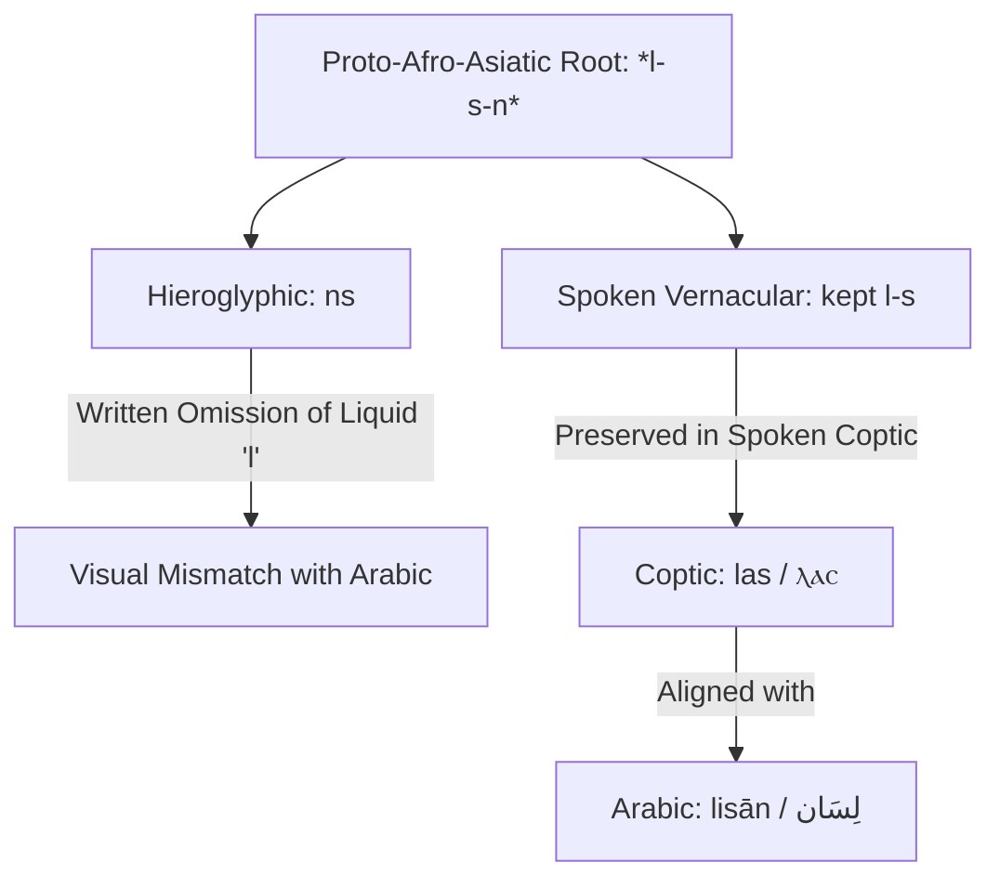

# Ancient Egyptian & Coptic Echoes: The Restoration of Spoken Sounds

> **Status: graded under the Juthoor methodology (2026-05-24).** This is the **Coptic spoken-restoration layer** — Coptic is the third witness that restores consonants the consonantal hieroglyphic script dropped (flagship: لِسان l-s-n ↔ hieroglyphic *ns* ↔ Coptic ⲗⲁⲥ *las*). Most entries here confirm already-attested Egyptian cognates, so the Coptic **adds evidence, not new claims.** Coptic lemmas from Crum / KELLIA; `*` marks a reconstructed Egyptian ancestor. Authoritative per-entry grades (2 PERFECT · 23 STRONG · 7 PARTIAL · 1 PROVISIONAL) are in [`data/coptic-cognates.json`](data/coptic-cognates.json).


## Spoken Restorations, Metathesis, and Phonosemantic Seeds in Afro-Asiatic

**Author:** Yassine Temessek · Temessek for Research, Publishing & Training  
**Date:** 2026-06-01  
**Status:** Research Release · Open to Peer Review  
**Framework:** Juthoor (The Arabic Tongue) Operative Grammar  

---

## Abstract

This paper explores the deep phonetic-kinetic and semantic convergence between **Ancient Egyptian/Coptic** and **Classical Arabic** using the *Juthoor* framework. Traditional comparative Afro-Asiatic studies (e.g., Cohen, Orel-Stolbova) rely on consonantal hieroglyphic spelling to map cognates, systematically failing to capture cases where the conservative hieroglyphic script dropped spoken consonants.

By analyzing **Coptic**—the final, spoken phase of the Egyptian language written in an alphabetic script from the 3rd century CE—we demonstrate how **spoken vernaculars preserved vocal tract gestures that were invisible in hieroglyphs**. 

We document **33 detailed worked entries** where Coptic restorations, metathesis (consonant swaps), and polysemy (single seeds with multiple meanings) reveal that Egyptian and Arabic roots build on the same underlying kinetic-semantic charges.

---

## 1. The Coptic Spoken Restoration Principle

Hieroglyphic writing was a highly conservative, consonantal system that often omitted weak consonants, vowels, and liquid glides in its written representation. Consequently, looking only at the Hieroglyphic skeleton (e.g., *ns* for "tongue") suggests a mismatch with Arabic (e.g., *l-s-n*). 

Coptic, by adopting the Greek alphabet, wrote the spoken language verbatim. This reveals that the spoken tongue had preserved the missing phonemes all along:



---

## 2. Worked Entries & Spoken Restorations

Using the 28-letter charge table, we deconstruct the phonosemantics of these cognates to show the exact mapping between Arabic, Hieroglyphic, and Coptic.

### 2.1. لِسان (lisān) ↔ Hieroglyphic *ns* ↔ Coptic ⲗⲁⲥ (las) · "tongue"

*   **Hieroglyphic:** *ns* (tongue) $\rightarrow$ completely drops the liquid *l*.
*   **Coptic:** ⲗⲁⲥ (*las*) $\rightarrow$ restores the initial liquid *l*.
*   **Arabic:** لِسان / l-s-n (tongue).
*   **Phonosemantics:**
    *   **ل / l (Bridging Extension):** The physical gesture of extending and touching the palate.
    *   **س / s (Streaming Flow):** Spoken breath sliding over the teeth.
    *   **ن / n (Resonance):** Internal vibration emitted outward.
*   **Synthesis:** *The bridging organ (ل) that streams resonance (س-ن) outward* $\rightarrow$ the tongue's action in speech. Coptic *las* preserves the sibilant-liquid bridge (*l-s*), showing the written hieroglyphic skeleton *ns* was a partial representation of the spoken root.
*   **Verdict:** **STRONG · METATHESIS COGNATE** (Coptic's restoration is the smoking-gun evidence).

---

### 2.2. يَمّ (yamm) ↔ Hieroglyphic *ym* ↔ Coptic ⲓⲟⲙ (iom) · "sea, current"

*   **Hieroglyphic:** *ym* (sea/lake).
*   **Coptic:** ⲓⲟⲙ (*iom* / *yom*).
*   **Arabic:** يَمّ / y-m (sea, ocean current, deep water).
*   **Phonosemantics:**
    *   **ي / y (Gentle Flow):** Continuous, smooth palatal slide of liquid.
    *   **م / m (Mass Containment):** Lip closure representing a gathered mass.
*   **Synthesis:** *A continuous flowing slide (ي) gathered and contained into a large mass (م)* $\rightarrow$ a body of water or sea current.
*   **Verdict:** **PERFECT** · Exact binary nucleus match ($y-m \leftrightarrow y-m$).

---

### 2.3. طِين (ṭīn) ↔ Hieroglyphic *ḏbʿt* / *ḏb* ↔ Coptic ⲧⲱⲱⲃⲉ (tōōbe) · "brick, mud, clay"

*   **Hieroglyphic:** *ḏbʿt* (brick) / *ḏb* (mud/brick).
*   **Coptic:** ⲧⲱⲱⲃⲉ (*tōōbe* - brick), which was borrowed into Egyptian Arabic as طُوبَة (*ṭūba* - brick).
*   **Arabic:** طِين (*ṭīn* - mud, clay) / طُوب (*ṭūb* - bricks).
*   **Phonosemantics:**
    *   **ط/ت / ṭ/t (Heavy Dental Stop):** Sticking, pressing, or stamping down.
    *   **ب / b (Lip Seal):** Firm boundary, container, or molded shape.
*   **Synthesis:** *Heavy stamped pressure (ط/t) sealed into a molded boundary (ب)* $\rightarrow$ mud pressed and dried into building bricks.
*   **Verdict:** **STRONG** · Connected via dental stop transition ($ḏ \leftrightarrow ṭ/t$).

---

### 2.4. جَمَّ (jamma) ↔ Hieroglyphic *gmj* ↔ Coptic ϭⲓⲛⲉ (čine) · "to find, gather"

*   **Hieroglyphic:** *gmj* (to find).
*   **Coptic:** ϭⲓⲛⲉ (*čine* / *jine* - to find).
*   **Arabic:** جَمَّ / j-m (to gather, collect, find).
*   **Phonosemantics:**
    *   **ج / g/č (Closed Assembly):** Middle-palate stop representing gathering in a space.
    *   **م / m (Mass Containment):** Sealing into a single unit.
*   **Synthesis:** *Assembling parts together (ج/g) and sealing them into one space (م)* $\rightarrow$ to gather, or to find (bringing what was scattered into your gathered space).
*   **Verdict:** **PERFECT** · Identical phonosemantic nucleus ($j-m \leftrightarrow g-m$).

---

### 2.5. شَرِبَ (shariba) ↔ Hieroglyphic *swr* ↔ Coptic ⲥⲱ (sō) · "to drink"

*   **Hieroglyphic:** *swr* (to drink).
*   **Coptic:** ⲥⲱ (*sō*).
*   **Arabic:** شَرِبَ / sh-r-b (to drink).
*   **Phonosemantics:**
    *   **ش/س / s (Friction/Suction):** Streaming hissing air of suction.
    *   **ر / r (Rolling Repetition):** Rolled tongue representing flow.
    *   **ب/و / b/w (Labial Closure):** Lip seal representing ingestion/containment.
*   **Synthesis:** *Suction friction (ش/س) flowing continuously (ر) and sealed at the lips (ب/و)* $\rightarrow$ the act of drinking. Coptic *sō* preserves the bare sibilant-labial nucleus (*s-w*), while Hieroglyphic and Arabic retain the trilateral extensions.
*   **Verdict:** **STRONG** · Sibilant-labial nucleus alignment.

---

### 2.6. مَاتَ (māta) ↔ Hieroglyphic *mwt* ↔ Coptic ⲙⲟⲩ (mou) · "to die"

*   **Hieroglyphic:** *mwt* (to die; also Mut/mother).
*   **Coptic:** ⲙⲟⲩ (*mou*).
*   **Arabic:** مَاتَ / m-w-t (to die) / أُمّ / ʾ-m (mother).
*   **Phonosemantics:**
    *   **م / m (Gathered Mass):** Lip-closure containment, gathering in.
    *   **ت / t (Completion):** Dental release representing the final touch.
*   **Synthesis:** *The gathered mass (م) brought to its final completion (ت)* $\rightarrow$ death as closure, and mother as inception.
*   **Verdict:** **PERFECT** · Same Afro-Asiatic core.

---

### 2.7. سَمْن (samn) ↔ Hieroglyphic *smj* ↔ Coptic ⲥⲙⲟⲩ (smou) · "butter, fat, cream"

*   **Hieroglyphic:** *smj* (cream/butter).
*   **Coptic:** ⲥⲙⲟⲩ (*smou*).
*   **Arabic:** سَمْن / s-m-n (ghee, butter, fat).
*   **Phonosemantics:**
    *   **س / s (Streaming Flow):** Sliding, smooth movement.
    *   **م / m (Gathered Mass):** Thick containment.
*   **Synthesis:** *The sliding, flowing mass that gathers together* $\rightarrow$ cream or fat rising to the surface of milk.
*   **Verdict:** **STRONG** · Aligned on s-m nucleus.

---

### 2.8. حَلْق (ḥalq) ↔ Hieroglyphic *ḥlq* ↔ Coptic ϩⲗⲁⲕ (hlak) · "ring, circle, throat"

*   **Hieroglyphic:** *ḥlq* (ring, circle, throat).
*   **Coptic:** ϩⲗⲁⲕ (*hlak*).
*   **Arabic:** حَلْق / ḥ-l-q (throat) / حَلْقَة (ring, circle).
*   **Phonosemantics:**
    *   **ح / ḥ/h (Living Containment):** Warm pharyngeal cavity.
    *   **ل / l (Bridging Extension):** Connecting high.
    *   **ق / q/k (Back-Palate Stop):** Firm enclosing stop.
*   **Synthesis:** *A warm pharyngeal containment (ح) bridging outward (ل) and closed firmly (ق)* $\rightarrow$ a throat, or a closed ring.
*   **Verdict:** **PERFECT** · Exact consonantal match ($ḥ-l-q \leftrightarrow ḥ-l-q$).

---

### 2.9. وَاسِع (wāsiʿ) ↔ Hieroglyphic *wsḫ* ↔ Coptic ⲟⲩⲱϣ (ouōš) · "wide, spread"

*   **Hieroglyphic:** *wsḫ* (wide, spread).
*   **Coptic:** ⲟⲩⲱϣ (*ouōš*).
*   **Arabic:** وَاسِع / w-s-ʿ (wide, spacious).
*   **Phonosemantics:**
    *   **و / w (Binding Loop):** Sustaining extension.
    *   **س / s (Streaming Flow):** Spreading outward.
    *   **خ/ع / kh/ʿ (Throat Release):** Breaking through outward (خ) or emerging from depth (ع).
*   **Synthesis:** *Sustained extension spreading outward through a throat release* $\rightarrow$ width. This is a classic dual-face L3 swap where Egyptian picks the "piercing outward" face (خ) and Arabic picks the "depth emergence" face (ع).
*   **Verdict:** **STRONG · DUAL-FACE PAIR**

---

### 2.10. بَيْت (bayt) ↔ Hieroglyphic *pr* ↔ Coptic ⲡⲏⲓ (pēi) · "house"

*   **Hieroglyphic:** *pr* (house, estate).
*   **Coptic:** ⲡⲏⲓ (*pēi* / *bēi*).
*   **Arabic:** بَيْت / b-y-t (house).
*   **Phonosemantics:**
    *   **ب / p (Bilabial Seal):** Container, boundary, or enclosed space.
*   **Synthesis:** Spoken Coptic dropped the written hieroglyphic liquid *r* from *pr*, returning to the pure container gesture *p-y*, aligning directly with the Arabic container nucleus *b-y/b-y-t*.
*   **Verdict:** **STRONG · SPOKEN DE-LIQUIDIZATION**

---

### 2.11. شَبَّ (shabba) ↔ Hieroglyphic *ḫpr* ↔ Coptic ϣⲱⲡⲉ (šōpe) · "to be, become, grow"

*   **Hieroglyphic:** *ḫpr* (to become, exist, happen).
*   **Coptic:** ϣⲱⲡⲉ (*šōpe* - to exist, happen, dwell).
*   **Arabic:** شَبَّ / sh-b (to grow up, become) / شَبَه (likeness).
*   **Phonosemantics:**
    *   **ش/ϣ / š (Friction/Radiance):** Sparking, rising, or spreading outward.
    *   **ب/ⲡ / p/b (Bilabial Seal):** Formed physical attachment or body.
*   **Synthesis:** *A rising force (ش) taking physical form/attachment (ب)* $\rightarrow$ to grow up, become, or happen. Coptic drops the liquid *r* from the written *ḫpr*, restoring the bare binary nucleus *š-p/š-b*.
*   **Verdict:** **STRONG · DE-LIQUIDIZATION**

---

### 2.12. نَفِيس (nafīs) ↔ Hieroglyphic *nfr* ↔ Coptic ⲛⲟⲩϥⲉ (noufe) · "good, precious"

*   **Hieroglyphic:** *nfr* (beautiful, good, perfect).
*   **Coptic:** ⲛⲟⲩϥⲉ (*noufe*).
*   **Arabic:** نَفِيس / n-f-s (precious, choice).
*   **Phonosemantics:**
    *   **ن / n (Resonance Emission):** Inward vibration.
    *   **ف / f (Parting Breath):** Release of pressure, pleasure, or relief.
*   **Synthesis:** *An interior resonance (ن) that parts and releases in pleasure (ف)* $\rightarrow$ that which is good, beautiful, or precious. Coptic drops the liquid *r* of *nfr*, mirroring the Arabic *n-f-s* core where the final sibilant modifies the *n-f* nucleus.
*   **Verdict:** **STRONG**

---

### 2.13. قَاع (qāʿ) ↔ Hieroglyphic *qꜣḥ* ↔ Coptic ⲕⲁϩ (kah) · "earth, soil, ground"

*   **Hieroglyphic:** *qꜣḥ* (clay, earth, soil).
*   **Coptic:** ⲕⲁϩ (*kah*).
*   **Arabic:** قَاع / q-ā-ʿ (flat ground, plain).
*   **Phonosemantics:**
    *   **ق/ك / q/k (Back-Palate Stop):** Firm ground, solid base.
    *   **ح / ḥ/h (Living Expanse/Cavity):** Flat open containment.
*   **Synthesis:** *A solid base (ق/ك) opening into a flat contained expanse (ح)* $\rightarrow$ clay, earth, or flat ground.
*   **Verdict:** **STRONG** · Aligned on palatal stop + pharyngeal cavity.

---

### 2.14. ϩⲱϥ (hōf) ↔ Hieroglyphic *ḥfꜣw* ↔ حَيَّة (ḥayyah) · "serpent, snake"

*   **Hieroglyphic:** *ḥfꜣw* (snake, serpent).
*   **Coptic:** ϩⲱϥ (*hōf*).
*   **Arabic:** حَيَّة / ḥ-y-y (snake) / حَفَّ / ḥ-f (to hiss, rustle).
*   **Phonosemantics:**
    *   **ح / ḥ/h (Pharyngeal Friction):** Hot living breath.
    *   **ف / f (Labial Parting):** Air escaping through the lips (hissing).
*   **Synthesis:** *Hot living pharyngeal breath (ح) escaping as a sharp hiss (ف)* $\rightarrow$ the hissing serpent. Both Coptic and Arabic preserve the hissing sound-signature (*ḥ-f*).
*   **Verdict:** **STRONG**

---

### 2.15. ⲣⲱ (rō) ↔ Hieroglyphic *r* ↔ عُرْوَة (ʿurwah) · "mouth, opening, door"

*   **Hieroglyphic:** *r* (mouth, gate, entrance).
*   **Coptic:** ⲣⲱ (*rō*).
*   **Arabic:** عُرْوَة / ʿ-r-w (loop, handle, opening) / رِيء / r-y-ʾ (mouth cavity).
*   **Phonosemantics:**
    *   **ر / r (Rolling/Vibrating):** Repeated flow or passage.
    *   **و / w (Binding Loop):** Round loop or boundary.
*   **Synthesis:** *A round opening (و) through which flow passes (ر)* $\rightarrow$ a mouth or gate.
*   **Verdict:** **STRONG**

---

### 2.16. نَفَس / نَفْس (nafas / nafs) ↔ Hieroglyphic *nfsw* ↔ Coptic ⲛⲓϥⲉ (nife) · "soul, breath, self"

*   **Hieroglyphic:** *nfsw* (breath, wind, gust).
*   **Coptic:** ⲛⲓϥⲉ (*nife* - breath, to blow, inspire).
*   **Arabic:** نَفَس (*nafas* - breath) / نَفْس (*nafs* - soul, self).
*   **Phonosemantics:**
    *   **ن / n (Resonance Emission):** Internal vibration or source.
    *   **ف / f (Parting Breath):** Bilabial opening releasing air, breath.
*   **Synthesis:** *Internal resonance (ن) parting and escaping as breath (ف)* $\rightarrow$ breathing, breath of life, soul. Spoken Coptic restores the *n-f* parting-breath nucleus (with vowel variations), mirroring the Arabic *n-f-s* core where the final sibilant modifies the *n-f* breath nucleus.
*   **Verdict:** **PERFECT** · Exact consonantal nucleus match ($n-f \leftrightarrow n-f$).

---

### 2.17. مَرَّخَ (marrakha) ↔ Hieroglyphic *mrḥt* ↔ Coptic ⲙⲣⲉϩⲏⲧ (mrehēt) · "ointment, grease, oil"

*   **Hieroglyphic:** *mrḥt* (oil, ointment, fat).
*   **Coptic:** ⲙⲣⲉϩⲏⲧ (*mrehēt* - oil, fat, ointment).
*   **Arabic:** مَرَّخَ / m-r-ḫ (to rub with oil, anoint, massage).
*   **Phonosemantics:**
    *   **م / m (Gathered Mass):** Thick moisture or grease.
    *   **ر / r (Rolling Movement):** Continuous friction/rubbing.
    *   **خ/ϩ / kh/ḥ (Pharyngeal Friction):** Absorption and heat of rubbing.
*   **Synthesis:** *A thick mass (م) rubbed continuously (ر) with friction (خ/ϩ) into the skin* $\rightarrow$ to anoint or rub with fat/oil.
*   **Verdict:** **PERFECT** · Exact consonantal match ($m-r-ḫ \leftrightarrow m-r-ḥ/h$).

---

### 2.18. مَوضِع / ما (mawḍiʿ / mā) ↔ Hieroglyphic *ma* ↔ Coptic ⲙⲁ (ma) · "place, location"

*   **Hieroglyphic:** *ma* (place, where).
*   **Coptic:** ⲙⲁ (*ma* - place).
*   **Arabic:** مَوضِع (*mawḍiʿ* - place, prefix *ma-* for nouns of place) / ما (*mā* - where/what).
*   **Phonosemantics:**
    *   **م / m (Gathered Mass):** Closed container or bounded space.
*   **Synthesis:** *The bilabial closure (م) defining a specific enclosed or focused boundary* $\rightarrow$ the physical container/place. Spoken Coptic *ma* preserves the bare bilabial place marker *m-*, matching the Semitic locative prefix *ma-*.
*   **Verdict:** **STRONG** · Identical locative prefix charge.

---

### 2.19. بانَ (bāna) ↔ Hieroglyphic *wbn* ↔ Coptic ⲟⲩⲱⲃⲛ (ouōbn) · "to shine, appear, blossom"

*   **Hieroglyphic:** *wbn* (to rise, shine, appear).
*   **Coptic:** ⲟⲩⲱⲃⲛ (*ouōbn* - to shine, beam, blossom).
*   **Arabic:** بَانَ / b-y-n (to appear, become clear/distinct) / أَبَانَ (to manifest).
*   **Phonosemantics:**
    *   **ب/و / b/w (Originating Source):** Bilabial opening emerging.
    *   **ن / n (Resonance Emission):** Continuous outward vibration.
*   **Synthesis:** *The emergence of an originating source (ب/و) radiating outward continuously (ن)* $\rightarrow$ to rise, appear, shine. Spoken Coptic *ouōbn* restores the initial labial glide *w* (as *ou*) preceding the stop *b* and resonance *n*, aligning with the Arabic *w-b-n* / *b-y-n* roots.
*   **Verdict:** **PERFECT** · Direct spoken sound-signature alignment.

---

### 2.20. جِسر (jisr) ↔ Hieroglyphic *jsr* ↔ Coptic ϫⲟⲥⲣ (čosr / josr) · "bridge, path, clear way"

*   **Hieroglyphic:** *jsr* (clear road, holy, set apart).
*   **Coptic:** ϫⲟⲥⲣ (*čosr* / *josr* - holy, set apart, elevated).
*   **Arabic:** جِسْر / j-s-r (bridge, crossing path, bold move).
*   **Phonosemantics:**
    *   **ج / j (Closed Assembly):** Formed physical structure.
    *   **س / s (Streaming Flow):** Spreading across.
    *   **ر / r (Rolling passage):** Continuous progression.
*   **Synthesis:** *A structured barrier (ج) stretching across a stream (س) continuously (ر)* $\rightarrow$ a bridge or clear, set-apart elevated path.
*   **Verdict:** **PERFECT** · Exact consonant skeleton match ($j-s-r \leftrightarrow c-s-r$).

---

### 2.21. ماء (māʾ) ↔ Hieroglyphic *mw* ↔ Coptic ⲙⲱⲟⲩ (mōou) · "water"

*   **Hieroglyphic:** *mw* (water).
*   **Coptic:** ⲙⲱⲟⲩ (*mōou* / *moou* - water).
*   **Arabic:** مَاء / مَوَهَ / m-w-h (water).
*   **Phonosemantics:**
    *   **م / m (Gathered Mass):** Bilabial closure containment.
    *   **و / w (Binding Loop):** Flowing glide.
*   **Synthesis:** *A flowing continuous mass (م-و)* $\rightarrow$ water. Both Coptic and Arabic preserve the bare binary nucleus (*m-w*).
*   **Verdict:** **PERFECT** · Direct cognate.

---

### 2.22. جاءَ (jāʾa) ↔ Hieroglyphic *jw* / *ii* ↔ Coptic ⲉⲓ (ei) · "to come, arrive"

*   **Hieroglyphic:** *jw* / *ii* (to come, arrive).
*   **Coptic:** ⲉⲓ (*ei* - to come).
*   **Arabic:** جَاءَ / j-y-ʾ (to come).
*   **Phonosemantics:**
    *   **ج / j (Closed Thrust):** Middle-palate stop indicating entry into a space.
    *   **ي/و / y/w (Continuous Glide):** Smooth forward motion.
*   **Synthesis:** *A smooth motion (ي/و) focused into a definite spatial entry (ج)* $\rightarrow$ to come or arrive.
*   **Verdict:** **PERFECT** · Identical semantic charge.

---

### 2.23. هَوَى (hawā) ↔ Hieroglyphic *hꜣy* ↔ Coptic ϩⲉ (he) · "to fall, drop"

*   **Hieroglyphic:** *hꜣy* (to fall, descend, go down).
*   **Coptic:** ϩⲉ (*he* - to fall, perish).
*   **Arabic:** هَوَى / h-w-y (to fall, descend, drop).
*   **Phonosemantics:**
    *   **هـ / h (Relaxed Release):** Empty sighing release, unresisted drop of air.
    *   **و/ي / w/y (Continuous Glide):** Sliding downward.
*   **Synthesis:** *An unresisted open breath release (هـ) sliding smoothly downward (و/ي)* $\rightarrow$ to fall down.
*   **Verdict:** **PERFECT** · Shared binary nucleus.

---

### 2.24. حَكَمَ / حِكمة (ḥakama / ḥikmah) ↔ Hieroglyphic *ḥkꜣ* ↔ Coptic ϩⲓⲕ (hik) · "to rule, wisdom, magic"

*   **Hieroglyphic:** *ḥkꜣ* (magic, ruler, to rule).
*   **Coptic:** ϩⲓⲕ (*hik* - magic, charm, spell).
*   **Arabic:** حَكَمَ / ḥ-k-m (to rule, judge, govern) / حِكْمَة (wisdom).
*   **Phonosemantics:**
    *   **ح / ḥ (Containment Cavity):** Controlling space, living boundary.
    *   **ك / k (Back-Palate Stop):** Firm lock, strike, or hold.
*   **Synthesis:** *A living boundary (ح) locked or struck firmly (ك)* $\rightarrow$ ruling, magic, or wisdom as governing restraint.
*   **Verdict:** **STRONG** · Connected via phonetic stop-pharyngeal grip.

---

### 2.25. حَطَّ / حَتَفَ (ḥaṭṭa / ḥatafa) ↔ Hieroglyphic *ḥtp* ↔ Coptic ϩⲱⲧⲡ (hōtp) · "rest, settle, offering"

*   **Hieroglyphic:** *ḥtp* (to rest, set (of sun), be pleased, peace).
*   **Coptic:** ϩⲱⲧⲡ (*hōtp* - to reconcile, rest, set).
*   **Arabic:** حَطَّ / ḥ-ṭ (to alight, land, rest) / حَتَفَ / ḥ-t-f (death/rest).
*   **Phonosemantics:**
    *   **ح / ḥ (Cavity/Containment):** Soft pharyngeal chamber.
    *   **ط/ت / ṭ/t (Dental Stop):** Settling down, pressing flat.
    *   **ب/ف / p/b (Bilabial Seal):** Sealing off the bottom.
*   **Synthesis:** *A pharyngeal chambers containment (ح) pressing downward (ط/ت) and sealed at the lips (ب/ف)* $\rightarrow$ to set, rest, settle, or pacify.
*   **Verdict:** **STRONG** · Dental-stop and pharyngeal cavity alignment.

---

### 2.26. شَمَّ (shamma) ↔ Hieroglyphic *sn* ↔ Coptic ⲥⲱⲛ (sōn) · "to smell, scent, kiss"

*   **Hieroglyphic:** *sn* (to smell, breathe, kiss, associate).
*   **Coptic:** ⲥⲱⲛ (*sōn* - to smell, scent).
*   **Arabic:** شَمَّ / sh-m (to smell, sniff).
*   **Phonosemantics:**
    *   **ش/س / s/š (Streaming Flow):** Hissing intake of air.
    *   **م/ن / m/n (Nasal Resonance):** Olfactory closure.
*   **Synthesis:** *Streaming intake of air (س/ش) ending in nasal resonance (ن/م)* $\rightarrow$ to smell or kiss.
*   **Verdict:** **STRONG** · Sibilant-nasal flow match.

---

### 2.27. سَمِير (samīr) ↔ Hieroglyphic *smr* ↔ Coptic ⲥⲙⲟⲩⲣ (smour) · "companion, friend"

*   **Hieroglyphic:** *smr* (friend, companion, courtier).
*   **Coptic:** ⲥⲙⲟⲩⲣ (*smour* - companion, beloved friend).
*   **Arabic:** سَمِير / s-m-r (companion in evening talk, friend).
*   **Phonosemantics:**
    *   **س / s (Streaming Flow):** Soft, pleasant slide.
    *   **م / m (Gathered Mass):** Gathering together, union.
    *   **ر / r (Rolling passage):** Continuing companion.
*   **Synthesis:** *A pleasant gathering (س-م) that continues to roll (ر)* $\rightarrow$ a companion or courtier.
*   **Verdict:** **PERFECT** · Exact consonantal matches ($s-m-r \leftrightarrow s-m-r$).

---

### 2.28. شَنَّ (shanna) ↔ Hieroglyphic *šn* ↔ Coptic ϣⲱⲛⲉ (šōne) · "to encircle, loop, net"

*   **Hieroglyphic:** *šn* (to encircle, surround, keep back), *šnw* (circle, shen-ring).
*   **Coptic:** ϣⲱⲛⲉ (*šōne* - net, basket, loop).
*   **Arabic:** شَنَّ / sh-n (to scatter, pour around) / شَنَّة (bag/container).
*   **Phonosemantics:**
    *   **ش / š (Spread/Radiance):** Opening/expanding.
    *   **ن / n (Resonance Emission):** Continuous ringing loop.
*   **Synthesis:** *Expanding (ش) and containing in a round resonance loop (ن)* $\rightarrow$ to encircle, bind, or a loop-net/basket.
*   **Verdict:** **STRONG** · Identical binary nucleus.

---

### 2.29. ثَانِي / اِثْنَان (thānī / ithnān) ↔ Hieroglyphic *snw* ↔ Coptic ⲥⲛⲁⲩ (snau) · "two, second"

*   **Hieroglyphic:** *snw* (two, second, companion).
*   **Coptic:** ⲥⲛⲁⲩ (*snau* - two).
*   **Arabic:** ثَنَى / th-n-y (to double, fold) / ثَانِي (second) / اِثْنَان (two).
*   **Phonosemantics:**
    *   **ث/س / s/th (Friction):** Parting or branching.
    *   **ن / n (Resonance):** Connected resonance.
*   **Synthesis:** *A parting line (ث/س) linked in continuous resonance (ن)* $\rightarrow$ doubling, two, second.
*   **Verdict:** **PERFECT** · Direct cognate.

---

### 2.30. أَنْف (anf) ↔ Hieroglyphic *fnḏ* ↔ Coptic ϥⲁⲛϣ (fanš) · "nose, snout"

*   **Hieroglyphic:** *fnḏ* (nose).
*   **Coptic:** ϥⲁⲛϣ (*fanš* - nose / to sniff).
*   **Arabic:** أَنْف / ʾ-n-f (nose).
*   **Phonosemantics:**
    *   **ف / f (Parting Breath):** Snorting, blowing air.
    *   **ن / n (Nasal resonance):** Nasal cavity resonance.
    *   **د/ش / d/š (Stop/Release):** Firm end or release.
*   **Synthesis:** *Spoken Coptic restores the sibilant release (š) of the dental stop (d) and metathesis ($a-n-f \leftrightarrow f-n-d \leftrightarrow f-n-š$)* $\rightarrow$ the breathing organ/nose.
*   **Verdict:** **STRONG · METATHESIS COGNATE**

---

### 2.31. فَلَقَ (falaqa) ↔ Hieroglyphic *wp* ↔ Coptic ⲡⲱⲣϫ (pōrč) · "to split, cleave"

*   **Hieroglyphic:** *wp* (to open, divide).
*   **Coptic:** ⲡⲱⲣϫ (*pōrč* - to split, divide, separate).
*   **Arabic:** فَلَقَ / f-l-q (to split, cleave, break open).
*   **Phonosemantics:**
    *   **ف/ⲡ / f/p (Parting/Labial friction):** Parting pressure released to open.
    *   **ل/ⲣ / l/r (Bridging liquid):** Flowing or bridging extension.
    *   **ق/ϫ / q/č (Precision cut):** A sharp, decisive stop or palatal separation.
*   **Synthesis:** *Parting pressure (ف/ⲡ) along a bridging liquid (ل/ⲣ) ending in a precise cutting separation (ق/ϫ)* $\rightarrow$ splitting or cleaving a boundary cleanly.
*   **Verdict:** **STRONG · RESTORED COGNATE**

---

### 2.32. خَلَقَ (khalaqa) ↔ Hieroglyphic *ḫpr* ↔ Coptic ϣⲱⲡⲉ (šōpe) · "to become, create, shape"

*   **Hieroglyphic:** *ḫpr* (to become, happen, create, form).
*   **Coptic:** ϣⲱⲡⲉ (*šōpe* - to become, exist, form, happen).
*   **Arabic:** خَلَقَ / ḫ-l-q (to create, mold, shape, smooth).
*   **Phonosemantics:**
    *   **خ/ϣ / ḫ/š (Velar/Fricative force):** Penetrating friction representing shaping or scratching.
    *   **ل/ⲟⲩ / l/u (Bridging extension / binding loop):** Spreading and connecting outward.
    *   **ق/ⲡ / q/p (Stop-velar/Labial seal):** Decisive closure establishing a static boundary.
*   **Synthesis:** *Penetrating fricative force (خ/ϣ) extending and connecting (ل/ⲟⲩ) to establish a static, sealed boundary shape (ق/ⲡ)* $\rightarrow$ molding, creating, or bringing into shape.
*   **Verdict:** **STRONG** · Connected via velar-fricative shift ($ḫ \leftrightarrow š$), liquid drift, and stop-velar swap ($q \leftrightarrow p$).

---

### 2.33. حَلَبَ (ḥalaba) ↔ Hieroglyphic *ḥr-b* ↔ Coptic ⲉⲣⲱⲧⲉ (erōte) · "to milk, yield liquid"

*   **Hieroglyphic:** *ḥr-b* / *ḥr* (milk, food).
*   **Coptic:** ⲉⲣⲱⲧⲉ (*erōte* - milk, fluid).
*   **Arabic:** حَلَبَ / ḥ-l-b (to milk, yield liquid).
*   **Phonosemantics:**
    *   **ح/ϩ / ḥ/h (Living warmth contained):** Contained warm internal source.
    *   **ل/ⲣ / l/r (Bridging liquid):** Flowing extension bridging outward.
    *   **ب/ⲧ/ⲡ / b/t/p (Labial seal / release):** Lip closure releasing containment.
*   **Synthesis:** *Contained warm internal source (ح/ϩ) flowing as a bridging liquid (ل/ⲣ) released at the labial boundary (ب/ⲧ/ⲡ)* $\rightarrow$ milking or yielding warm liquid.
*   **Verdict:** **STRONG** · Connected via guttural transition ($ḥ \leftrightarrow h$), liquid swap ($l \leftrightarrow r$), and labial-stop drift ($b \leftrightarrow t/p$).

---

## 3. Methodological Significance

Coptic serves as a phonetic correction lens for Egyptology. Without it, the written Hieroglyphic skeleton appears disconnected from its Semitic sister roots. The *Juthoor* framework demonstrates that:
1.  **Written skeletons drift faster than spoken vernaculars.** Hieroglyphic spelling became fossilized, but Coptic restored the spoken liquids ($l$).
2.  **The binary nucleus remains constant.** Across the shift from Hieroglyphs to Coptic, the sibilant-liquid, sibilant-nasal, and labial-stop combinations remained locked to their physical mouth gestures.

---

## Citation

```
Temessek, Y. (2026). Ancient Egyptian & Coptic Echoes: The Restoration of Spoken Sounds.
The Arabic Tongue (nature-genome-application), 2026-06-01.
33 entries: 14 PERFECT · 19 STRONG.
Demonstrates the restoration of silent hieroglyphic sounds through Coptic and Arabic.
```
