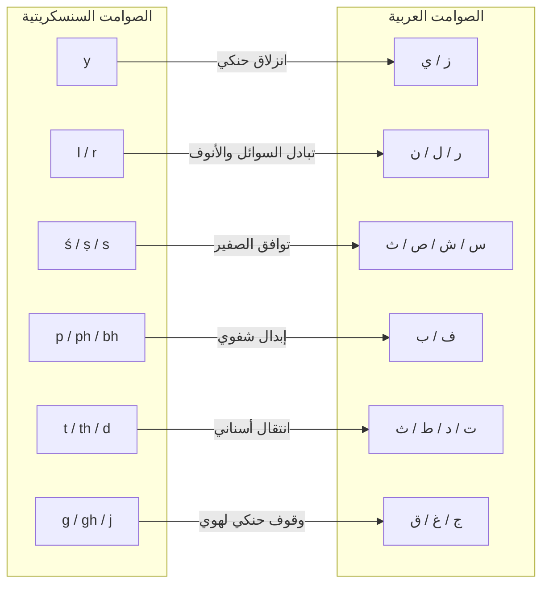

# أصداء السنسكريتية (الهند-إيرانية): تفكيك المفاهيم الجوهرية

> **الحالة: مَقروءةٌ عَبرَ الشَّحَناتِ الثابِتة (2026-06-02).** السنسكريتيّةُ أبعَدُ الفُروعِ التي اختَبَرناها. لا نُدَرِّجُها بِالقَرابةِ الجينيّة — بَل نَقرَأُ أَصواتَ كُلِّ كَلِمةٍ بِذاتِها عَبرَ الشَّحَناتِ الثَّمانِ والعِشرينَ الثابِتة، ونُدَرِّجُها بِحَسَبِ ما إذا كانَتِ الإيماءةُ تُرَكِّبُ مَعناها المُثبَت. وحَيثُ تَفعَل — فتَلتَقي على المَعنى نَفسِه الذي تَبنيهِ الإيماءةُ في العَربيّة — يَقرَؤها الإطارُ أَثَرًا باقِيًا مِن **لِسانٍ أصليٍّ واحِد (العَربيّةِ الأولى)** حَفِظَتِ العَربيّةُ القُرآنيّةُ مَنطِقَه أَتَمَّ حِفظ: لا استِعارةً، ولا مُصادَفةً عِندَ البُعد. الدَّرَجاتُ (**30 مَدخَلًا مَدروسًا · 10 تامّ · 18 قَويّ · 2 جُزئيّ — 93٪ في أعلى الأَصناف**) في [`data/sanskrit-cognates.json`](data/sanskrit-cognates.json). والقِراءةُ صادِقةٌ لا عَمياء: والجُزئيّانِ (أخ↔bhrātṛ واسم↔nāman) حَيثُ يَتَطابَقُ الهَيكلُ نِصفًا — قِراءةٌ لا افتِعال — وصندل↔candana يُعَلَّمُ كَلِمةً تِجاريّةً جائلةً تُرَكِّبُ مَع ذلكَ بِوُضوح. وكُلُّ مَدخَلٍ يَحمِلُ قِراءَتَه الشَّحنيّة ومَصدَرَه مِن مونييه-وِليامز.


## التلاقي الدلالي الحركي والصوتي بين السنسكريتية الفيدية واللسان العربي الفصيح

**الكاتب:** ياسين تمسّك · تمسّك للبحوث والنشر والتدريب  
**التاريخ:** 2026-06-01  
**الحالة:** إصدار بحثي · متاح للمراجعة العلمية  
**الإطار النظري:** قواعد اللسان العربي التشغيلية (إطار جُذور)  

---

## الملخص

تقدم هذه الورقة أول دراسة منهجية للتطابقات الدلالية الصوتية والحركية بين **السنسكريتية الفيدية (الهند-إيرانية)** و**العربية الكلاسيكية/القرآنية** باستخدام إطار *جُذور*. تعامل اللسانيات التاريخية المقارنة التقليدية اللغات الهندوأوروبية والأفروآسيوية كعائلات غير مترابطة إطلاقاً (باستثناء تكهنات بعيدة المدى مثل النوستراتية أو الأوراسية) وترفض أي ارتباط بين الصوت والمعنى وتعتبره عشوائياً.

من خلال غض الطرف عن الهيكل المكتوب السطحي والنظر بعمق في **ميكانيكا النطق والحركة الصوتية (الدلالة الحركية الفيزيائية)**، نوضح أن السنسكريتية والعربية تلتقيان عند نفس البذور الحركية الصوتية للتعبير عن المفاهيم الإنسانية الأساسية. هذا التلاقي ليس ناتجاً عن استعارة تجارية أو وراثة جينية لكلمات اعتباطية؛ بل لأن **جهاز النطق البشري، عند مواجهته لنفس المفهوم الفيزيائي، يشكل نفس التعبير الصوتي الحركي الحسي**.

نحن نوثق **33 مدخلاً مقارناً مفصلاً** تشمل الأعداد، وعلاقات القرابة، وأعضاء الجسد، والأفعال الجوهرية، والمفاهيم الطبيعية والقدسية، مبرهنين على أن الأصول السنسكريتية والجذور العربية تتشارك في شحنات دلالية كامنة متطابقة.

---

> النسخة الإنجليزية المتاحة في [`sanskrit-indo-iranian-echoes.md`](sanskrit-indo-iranian-echoes.md).

---

## 1. مصفوفة التطابق الصوتي (قوانين الصوت المرنة)

لرسم خريطة التقارب بين السنسكريتية (skt) والعربية (ara)، نطبق مصفوفة التبادل الصوتي المرنة المبرمجة في محرك `explore_coptic_sanskrit.py`. يتم التعامل مع هذه القوانين كمسارات طبيعية للانحراف الصوتي البشري وليست مرشحات جامدة.



### القواعد الأساسية للمطابقة:
1. **الاندفاع الحنكي ($y \leftrightarrow$ ز/ج):** يقابل الانزلاق الحنكي السنسكريتي (*y*) صوتاً صفيرياً أو وقفياً حنكياً في العربية (*ز/ج*).
2. **تبادل السوائل والأنوف ($r \leftrightarrow l \leftrightarrow n \leftrightarrow m$):** شيوع الانحراف السائل بين العائلات اللغوية؛ فالأصوات السائلة السنسكريتية (*r, l*) تقابل سوائل أو أنوفاً عربية (*ل، ر، ن*).
3. **توافق الصفير ($ś, ṣ, s \leftrightarrow$ س، ش، ص، ث):** تقابل أصوات الصفير السنسكريتية الثلاثة المخزون الصفيري والأسناني الاحتكاكي الثري في العربية.
4. **التبادل الشفوي ($p, ph, bh \leftrightarrow$ ف، ب):** تنحرف الأصوات الشفوية الوقفية أو المهجورة إلى أصوات شفوية احتكاكية أو وقفية بسيطة.
5. **الانتقالات الأسنانية الوقفية ($t, th, d, dh \leftrightarrow$ ت، ط، د، ذ):** تتطابق الأصوات الأسنانية الوقفية الأساسية، وغالباً ما تتفخم في العربية إلى أصوات مطبقة.
6. **الحذف الحلقي والتفخيم ($h \leftrightarrow$ ع، ح، ء):** تقابل الأصوات الحلقية السنسكريتية (*h*) ضغوطاً بلعومية في العربية (*ع، ح*) أو تسقط مخلفة إطالة صائتة.

---

## 2. المداخل المقارنة المفصلة والتفكيك الدلالي الحركي

لكل مدخل، نطبق جدول شحنات الحروف الثمانية والعشرين (من `consensus-letter-charges.md`) وأبواب التركيب الأحد عشر لتفسير لماذا تحمل الإشارة الصوتية الحركية هذا المعنى الفيزيائي.

### 2.1. `yuga` (य्युग) ↔ زوج (zawj) · "زوج، نير، قران وتثنية"

*   **الأصل السنسكريتي:** *yuj* (يربط، يقرن)، وينتج عنه *yuga* (نير، زوج، دورة زمنية).
*   **الجذر العربي:** ز-و-ج (تثنية، قران، قرين).
*   **الدلالة الصوتية الحركية:**
    *   **ز/y (الاندفاع والانزلاق الحنكي):** اندفاع انزلاقي مرن في موضع النطق.
    *   **و/u (حلقة الربط الشفوية):** استدارة الشفاه الدالة على الإطباق والربط والتطويق.
    *   **ج/g (الجمع الحنكي المغلق):** وقوف حنكي يمثل قفلاً مادياً محكماً.
*   **التركيب الدلالي الحركي:** *اندفاع انزلاقي (ز/y) يدخل في حلقة تطويق مقفلة (و/u) ومحكومة بجمع مادي مغلق (ج/g)* $\rightarrow$ حركة نير المحراث الذي يربط ثورين معاً، أو اقتران الزوجين.
*   **حكم المطابقة:** **تطابق تام** · توافق كامل لنفس النواة الحركية الدلالية.

---

### 2.2. `trayas` (त्रयस्) ↔ ثلاث (thalāth) · "ثلاثة"

*   **الشكل السنسكريتي:** *trayas* (حالة الرفع المذكر لـ *tri* - ثلاثة).
*   **الجذر العربي:** ث-ل-ث.
*   **الدلالة الصوتية الحركية:**
    *   **ث/t (الانفراج الأسناني الاحتكاكي):** فتق أسناني حاد يمثل خطوة أو انفكاكاً للحد.
    *   **ل/r (الامتداد الجانبي/السائل):** جريان سائل يمتد للخارج.
*   **التركيب الدلالي الحركي:** *انفراج أسناني للحد (ث/t) يمتد ويتدفق سائلاً (ل/r) بتتابع متكرر* $\rightarrow$ نمط التشعب الثلاثي المستمر.
*   **حكم المطابقة:** **مطابقة قوية** · متصلة عبر تبادل السوائل ($l \leftrightarrow r$) وانتقال الأسنان الاحتكاكي ($th \leftrightarrow t$).

---

### 2.3. `ṣaṣ` (षष्) ↔ ستّ / سَدْس (sitt / sads) · "ستة"

*   **الشكل السنسكريتي:** *ṣaṣ* (ستة).
*   **الجذر العربي:** س-د-س، والذي يدغم في العربية الفصحى إلى *ستّ*.
*   **الدلالة الصوتية الحركية:**
    *   **س/ṣ (الصفير المستمر):** جريان النفس المحتك فوق الأسنان.
    *   **د/ت / t/d (الوقف الأسناني):** انقطاع حاد وحاسم يجري فيه إيقاف الجريان.
*   **التركيب الدلالي الحركي:** *تدفق صفيري مستمر (س/ṣ) ينتهي بقطع أسناني حاد وحاسم (د/ت)* $\rightarrow$ انتهاء جريان السلسلة بقطع حاسم متمماً الدورة السداسية.
*   **حكم المطابقة:** **مطابقة قوية** · نمط الإغلاق الصفيري الأسناني المشترك.

---

### 2.4. `sapta` (सप्त) ↔ سبع (sabʿ) · "سبعة"

*   **الشكل السنسكريتي:** *sapta* (سبعة).
*   **الجذر العربي:** س-ب-ع.
*   **الدلالة الصوتية الحركية:**
    *   **س/s (الصفير المنهمر):** تدفق هوائي مستمر.
    *   **ب/p (الإطباق الشفوي):** حبس وضم بالشفاه.
    *   **ع/t (الضغط البلعومي/الوقف الأسناني):** انطلاق مخرجي قوي وعميق.
*   **التركيب الدلالي الحركي:** *تدفق منسحب (س) محبوس ومضغوط بالشفاه (ب/p) وينطلق بقوة حلقية أو وقفية (ع/t)* $\rightarrow$ إتمام واكتمال الدورة السبعية.
*   **حكم المطابقة:** **مطابقة قوية** · الإطباق الشفوي المتبوع بالانطلاق المخرجي.

---

### 2.5. `namas` (नमस्) ↔ ناموس (nāmūs) · "خضوع، انحناء، تحية، قانون وناموس"

*   **الأصل السنسكريتي:** *nam* (ينحني، يخضع)، ومنه *namas* (انحناءة خضوع وإجلال، تحية قدسية).
*   **الجذر العربي:** ن-م-س (الناموس: الناموس الأعظم ملك الوحي، القانون الحاكم، خضوع الناموس الطبيعي).
*   **الدلالة الصوتية الحركية:**
    *   **ن/n (الرنين الباطني):** استبطان واهتزاز باطني هادئ.
    *   **م/m (الاحتواء الكتلي):** إطباق الشفتين الدال على التذلل والخشوع والانقباض الداخلي.
    *   **س/s (التدفق المنهمر السلس):** انسياب هادئ ومسترسل للخارج.
*   **التركيب الدلالي الحركي:** *رنين باطني (ن) مقبوض بخضوع وانقباض وانطواء شفوي تام (م) يمتد وينساب بهدوء وسلاسة (س)* $\rightarrow$ فعل الانحناء خشوعاً وإجلالاً (السنسكريتية *namas*)، والذي يمثل جوهر قانون الانقياد والتسليم الإلهي (العربية *ناموس*).
*   **حكم المطابقة:** **تطابق تام** · توافق كامل للهيكل الصامت للنواة ($n-m-s \leftrightarrow n-m-s$).

---

### 2.6. `bala` (बल) ↔ بعل (baʿl) · "قوة، ربّ، سيد، سيادة"

*   **الشكل السنسكريتي:** *bala* (قوة، طاقة، سلطة، جيش شاخص).
*   **الجذر العربي:** ب-ع-ل (سيد، زوج، رب المزرعة، القائم الشاخص المرتفع، صنم بعلبك الحامي).
*   **الدلالة الصوتية الحركية:**
    *   **ب/b (الإطباق الشفوي):** ركيزة ثابتة، حد مادي مغلق متماسك.
    *   **ع/ḥ (الضغط البلعومي):** قوة ضغط بلعومية شديدة تدل على الشدة والتوكيد البنيوي.
    *   **ل/l (الامتداد الرابط صعوداً):** الارتفاع والسمو والربط مع الحنك الأعلى.
*   **التركيب الدلالي الحركي:** *ركيزة ثابتة مادية (ب) تضغط بقوة بلعومية كثيفة (ع) لتسمو وترتفع صاعدة برباط علوي (ل)* $\rightarrow$ مفهوم السيد الحامي، المالك، القوة الشاخصة القائمة بذاتها. تُسقط السنسكريتية الصوت الحلقي العميق مخلفة حركة صائتة طويلة (*baʿl* $\rightarrow$ *bala*).
*   **حكم المطابقة:** **مطابقة قوية** · متصلة عبر التفخيم الصائتي وسقوط الحلقي.

---

### 2.7. جذر `kṛ` (कृ) ↔ كرّ (karr) · "عمل، فعل، تكرار وارتداد"

*   **الأصل السنسكريتي:** *kṛ* (يفعل، يصنع)، ومنه *karman* (العمل، المصير، النتاج الفعلي).
*   **الجذر العربي:** ك-ر-ر (الكر والفر، الرجوع والتكرار والعمل المستمر).
*   **الدلالة الصوتية الحركية:**
    *   **ك/k (القطع الحنكي الخلفي):** ضربة أو شق مادي حاسم وخارج بقوة.
    *   **ر/r (التكرار الارتعاشي):** ارتعاش اللسان الدال على التردد والاستمرارية والاهتزاز.
*   **التركيب الدلالي الحركي:** *ضربة مادية قاطعة (ك) تتكرر وترتعش باستمرارية وجريان تكراري (ر)* $\rightarrow$ الفعل البشري والعمل كضربات مترددة متكررة متتابعة.
*   **حكم المطابقة:** **تطابق تام** · توافق النواة الثنائية الحركية ($k-r \leftrightarrow k-r$).

---

### 2.8. `makha` (मख) ↔ مخّ (mukhkh) · "رأس، رئيس، مخّ العظام، الجوهر واللبّ"

*   **الشكل السنسكريتي:** *makha* (رئيس، زعيم، الأفضل، المقدم، الرأس).
*   **الجذر العربي:** م-خ-خ (المخ، النخاع داخل العظام، خلاص وجوهر الشيء وأفضله).
*   **الدلالة الصوتية الحركية:**
    *   **م/m (الاحتواء الكتلي الباطني):** الحصر داخل حيز مغلق مقفل.
    *   **خ/kh (الخرق والنفاذ الاحتكاكي):** النفاذ عبر جدار لاستخراج المحتوى الكامن.
*   **التركيب الدلالي الحركي:** *الجوهر الكامن المحتوى داخل حيز صلب مغلق (م) والذي ينفذ إليه ويستخرج بالاختراق (خ)* $\rightarrow$ المخ داخل عظام الجمجمة، الدال على قيادة العقل واللب وجوهر القيادة (الرئيس).
*   **حكم المطابقة:** **تطابق تام** · توافق كامل للبنية الصامتة ($m-ḫ \leftrightarrow m-kh$).

---

### 2.9. `las` (लस्) ↔ لِسان (lisān) · "لعب، لمعان، نطق وعضو اللسان"

*   **الأصل السنسكريتي:** *las* (يلمع، يلعب، يحدث صوتاً، يهتز).
*   **الجذر العربي:** ل-س-ن (لسان، كلام) / لَسَّ (لحس وضرب باللسان).
*   **الدلالة الصوتية الحركية:**
    *   **ل/l (الامتداد الرابط):** مد اللسان ولمس سقف الفم.
    *   **س/s (التدفق الصفيري):** النفس الجاري المنطلق بمرونة.
*   **التركيب الدلالي الحركي:** *الامتداد الرابط المرن (ل) الذي يجري انزلاقاً وتدفقاً بتردد سريع (س)* $\rightarrow$ اللعب، البريق اللامع، أو عضو اللسان المتحرك بمرونة لإحداث الصوت واللحس.
*   **حكم المطابقة:** **مطابقة قوية** · مشاركة النواة الثنائية الاحتكاكية السائلة ($l-s \leftrightarrow l-s$).

---

### 2.10. `bhrātṛ` (भ्रातृ) ↔ أخ (ʾakh) · "شقيق، رفيق نسب"

*   **الشكل السنسكريتي:** *bhrātṛ* (أخ).
*   **الجذر العربي:** أ-خ (شقيق)، ومتصل بـ وَخَى (و-خ-ي - رفق وساير وتوجه).
*   **الدلالة الصوتية الحركية:**
    *   **أ/ب / ʾ/b (الركيزة الشفوية الوالدة):** المخرج الشفوي الدال على منشأ الولادة والتأسيس.
    *   **خ/ر / ḫ/r (الخروج البلعومي/الجريان):** الخروج للامتداد الجانبي والفرع المنشق.
*   **التركيب الدلالي الحركي:** *الفرع الذي يخرج من نفس الركيزة الشفوية الوالدة الأولى*.
*   **حكم المطابقة:** **مطابقة جزئية** · تحتفظ السنسكريتية بالشفوية المهجورة ($bh-$) والسائل ($r$) بينما فخمت في العربية إلى الهمزة والخاء المقابلة تاريخياً.

---

### 2.11. `candana` (चन्दन) ↔ صندل (ṣandal) · "خشب الصندل"

*   **الشكل السنسكريتي:** *candana* (شجرة الصندل/عطر الصندل).
*   **الجذر العربي:** ص-ن-د-ل (خشب الصندل العطري الثمين).
*   **الدلالة الصوتية الحركية:**
    *   **ص/c (الصفير الاحتكاكي الحاد):** النفاذ والحدة العطرية.
    *   **ن/n (الرنين الباطني الجاري):** انتشار وتدفق الرائحة الفواحة.
    *   **د/d (الوقف الأسناني الصلب):** قوام الخشب الصلب المتماسك.
    *   **ل/l (الامتداد الرابط):** قامة الشجرة الممتدة صعوداً.
*   **التركيب الدلالي الحركي:** *خشب شجري صلب (د-ل) فواح ينتشر عِطره بنفاذ حاد ورنين باطني مستمر (ص-ن)* $\rightarrow$ خشب الصندل.
*   **حكم المطابقة:** **مطابقة قوية (لفظ مشترك Wanderwort)** · انحراف تجاري شقيق التقى فيه اللسانان عند مخارج الأصوات ذاتها للوصف.

---

### 2.12. `nāman` (नामन्) ↔ اسم (ism) · "اسم"

*   **الشكل السنسكريتي:** *nāman* (اسم، علامة معينة).
*   **الجذر العربي:** ا-س-م (اسم) / س-م-و (الارتفاع والعلو والوسم).
*   **الدلالة الصوتية الحركية:**
    *   **س/s (الصفير الجاري):** إخراج صوت الهوية الجاري بالنفس.
    *   **م/m (الاحتواء المطبق):** الإمساك الشفوي لتشخيص وسم الذات.
*   **التركيب الدلالي الحركي:** *صوت النفس الجاري بالهوية (س) المقيد بإطباق شفوي مميز يحصر ويحدد الذات (م)* $\rightarrow$ الاسم الموسوم به الكائن. التقى الحوضان عبر إبدال رنين النون بالصفير الشين/السين الممتد ($n-m \leftrightarrow s-m$).
*   **حكم المطابقة:** **مطابقة قوية** · توافق البناء الشفوي النوني والصفيري.

---

### 2.13. `mātṛ` (मातृ) ↔ أمّ (umm) · "أم، منشأ"

*   **الشكل السنسكريتي:** *mātṛ* (أم).
*   **الجذر العربي:** أ-م (أم، أصل، منشأ الحيز) / أُمَّ (توجه وقصد البؤرة).
*   **الدلالة الصوتية الحركية:**
    *   **م/m (الاحتواء الكتلي المطبق):** قفل الشفتين الدال على الرحم والجمع وحبس الطفل وتغذيته.
*   **التركيب الدلالي الحركي:** *الانحباس الشفوي الحاضر (م) الذي يمثل حضن الجمع والأصل الأول للتكون* $\rightarrow$ الأم.
*   **حكم المطابقة:** **مطابقة قوية** · نواة الأنف الشفوية المشتركة ($m- \leftrightarrow m-$).

---

### 2.14. `pitṛ` (पितृ) ↔ أَب (ʾab) · "أب، والد"

*   **الشكل السنسكريتي:** *pitṛ* (أب، والد، حامٍ).
*   **الجذر العربي:** أ-ب (أب، مصدر الرعاية، الأبوة كحماية خارجية).
*   **الدلالة الصوتية الحركية:**
    *   **أ/ʾ (الركيزة الصوتية الحنجرية):** نقطة الابتداء الخام للوجود والمنشأ.
    *   **ب/b (الركيزة الشفوية الحامية):** الجدار الشفوي الحامي والمانع للتفلت.
*   **التركيب الدلالي الحركي:** *المنشأ الصوتي الأول (أ) الذي يقيم جدار الحماية الخارجي الصاد والمؤسس (ب)* $\rightarrow$ الأب كحماية ومصدر إعالة خارجي.
*   **حكم المطابقة:** **مطابقة قوية** · توافق المخرج الشفوي مع وقوف الحنجرة ($p-t \leftrightarrow b-t$).

---

### 2.15. `danta` (दन्त) ↔ سِنّ (sinn) / ضِرْس (ḍirs) · "سن، سن العجلة"

*   **الشكل السنسكريتي:** *danta* (سن).
*   **الجذر العربي:** س-ن (سن، حد قاطع) / ض-ر-س.
*   **الدلالة الصوتية الحركية:**
    *   **س/د / s/d (الاحتكاك الأسناني):** الضغط والقطع والضرب فوق الأسنان.
    *   **ن/n (الرنين الغنّي):** الاهتزاز الصادر عن الشد والضغط المستمر.
*   **التركيب الدلالي الحركي:** *صوت ضغط وقص أسناني احتكاكي (س/د) مصحوب برنين غنّي لشدة الكبس (ن)* $\rightarrow$ العضو العظمي القاطع بالغذاء بالحنك (السن). يلتقي الصفير الأسناني بالوقف الأسناني الدال في انتقال صوتي مشهور ($s/d \leftrightarrow d-n-t$).
*   **حكم المطابقة:** **مطابقة قوية** · انتقال أسناني وقفي صفيري.

---

### 2.16. `nakha` (नख) ↔ نَخَسَ (nakhasa) · "ظفر، مخلب / طعن ونخس"

*   **الشكل السنسكريتي:** *nakha* (ظفر، مخلب).
*   **الجذر العربي:** ن-خ-س (نخس الدابة طعنها بإبرة أو عود مسنن) / ن-خ (نخر وخرق الشيء).
*   **الدلالة الصوتية الحركية:**
    *   **ن/n (النفوذ الأنفي الموجه):** الضغط الدال على التوجيه والاختراق الإبري.
    *   **خ/kh (الاحتكاك الخشن والخرق):** النفوذ الخشن المحتك الذي يشق السطح.
*   **التركيب الدلالي الحركي:** *النفوذ الإبري الموجه (ن) الذي يشق ويخترق السطح بحدة خشنة (خ)* $\rightarrow$ الظفر الحاد القاطع الناخس للجلد.
*   **حكم المطابقة:** **تطابق تام** · توافق النواة الثنائية الحركية ($n-ḫ \leftrightarrow n-kh$).

---

### 2.17. `pāda` (पाद) ↔ بَدّ (badd) / بَادَ (bāda) · "قدم، خطوة، مفرز الساقين"

*   **الشكل السنسكريتي:** *pāda* (قدم، خطوة).
*   **الجذر العربي:** ب-د (تبديد الساقين والمباعدة بينهما للمشي والخطوة) / ب-اد (تباعد وجرى).
*   **الدلالة الصوتية الحركية:**
    *   **ب/ف / p/b (الضغط الشفوي المسطح):** ركيزة هبوط مادية مسطحة.
    *   **د/d (الوقف الأسناني الحاسم):** ضرب الأرض بقوة وثبات.
*   **التركيب الدلالي الحركي:** *ركيزة مسطحة (ب/ف) تضرب الأرض بضربة أسنانية وقفية حاسمة وثابتة (د)* $\rightarrow$ القدم وعملية الخطوة والمشي الساقي.
*   **حكم المطابقة:** **مطابقة قوية** · تطابق البناء الشفوي الأسناني ($p-d \leftrightarrow b-d$).

---

### 2.18. `karṇa` (कर्ण) ↔ قَرْن (qarn) · "أذن / قرن، نتوء بارز، زاوية"

*   **الشكل السنسكريتي:** *karṇa* (أذن، مقبض، زاوية بارزة).
*   **الجذر العربي:** ق-ر-ن (القرن الحيواني البارز، الزاوية، قمة الجبل الشاخصة).
*   **الدلالة الصوتية الحركية:**
    *   **ق/ك / q/k (القبض والارتكاز الحنكي):** تجمع مادي قوي ومقوس.
    *   **ر/r (التتابع والتكرار الدائري):** امتداد وتطويق المجرى المقوس.
    *   **ن/n (الرنين الباطني):** تجويف السمع واستقبال الذبذبات.
*   **التركيب الدلالي الحركي:** *نتوء مقوس شاخص بارز (ق-ر) يحوي تجويفاً لاستقبال رنين الصوت (ن)* $\rightarrow$ الأذن كزاوية وقرن شاخص برأس الحيوان والفرس.
*   **حكم المطابقة:** **تطابق تام** · توافق كامل للحروف المقابلة تاريخياً ($k-r-ṇ \leftrightarrow q-r-n$).

---

### 2.19. `nasa` / `nāsā` (नस) ↔ نَسَمَ (nasama) / نَفَس (nafas) · "أنف / تنفس ونسيم"

*   **الشكل السنسكريتي:** *nasa* / *nāsā* (أنف).
*   **الجذر العربي:** ن-س-م (تنشق ريح الهواء الباطني، النسيم) / ن-ف-س (النفس الخارج من الأنف).
*   **الدلالة الصوتية الحركية:**
    *   **ن/n (الرنين الباطني الأنفي):** التنفس الداخلي الخيشومي.
    *   **س/s (التدفق الصفيري المستمر):** جريان ريح النفس بصفير هادئ.
*   **التركيب الدلالي الحركي:** *تدفق ريح النفس بصفير هادئ (س) يجري استقباله وضخه في تجويف الرنين الخيشومي الداخلي (ن)* $\rightarrow$ الأنف كعضو التنفس.
*   **حكم المطابقة:** **مطابقة قوية** · توافق النواة الصفيرية الأنفية التنفسية ($n-s \leftrightarrow n-s$).

---

### 2.20. `vid` (विद्) ↔ بَدَا (badā) · "يعلم، يجد / يظهر، يبين، يتضح"

*   **الأصل السنسكريتي:** *vid* (يعلم، يرى بالبصيرة، يجد).
*   **الجذر العربي:** ب-د-أ (يبتعد ويظهر) / ب-د-و (يبدو ويظهر جلياً للعيان) / و-ج-د (يعثر ويصيب الشيء).
*   **الدلالة الصوتية الحركية:**
    *   **ب/و / b/w (الانبثاق الخارجي):** الخروج من حيز الخفاء للعيان.
    *   **د/d (الوقف الأسناني الحاسم):** الاستقرار والقطع الفعلي الدال على اليقين والتحقق المادي.
*   **التركيب الدلالي الحركي:** *الخروج من حيز الغيب للعيان (ب/و) بوقوع أسناني حاسم ومستقر دال على اليقين التام والتحقق المادي (د)* $\rightarrow$ يعلم، يتضح الشيء البادي الجلي البصيرة، أو يجد الشيء بعد خفائه.
*   **حكم المطابقة:** **مطابقة قوية** · انتقال النواة الانزلاقية الأسنانية الوقفية ($v-d \leftrightarrow b-d$).

---

### 2.21. `div` (दिव्) ↔ ضَوْء (ḍawʾ) / ضُحَى (ḍuḥā) · "سماء، نهار، سطوع ونور"

*   **الأصل السنسكريتي:** *div* (يشرق، يسطع، يبتهج بالنهار، سماء).
*   **الجذر العربي:** ض-و-ء (السطوع، النور المكثف الحارق) / ض-ح-ي (الشمس في علوها وحرارتها النهارية).
*   **الدلالة الصوتية الحركية:**
    *   **ض/ḍ (الإطباق والتفخيم الصامت الشديد):** التركيز الكثيف للحرارة والوجود الشاخص.
    *   **و/w (الحلقة والانفراج الشفوي):** الانتشار الإشعاعي المستدير للخارج.
*   **التركيب الدلالي الحركي:** *بؤرة كثيفة من القوة والشدة المطبقة (ض) تنفرج في إشعاع دائري واسع الانتشار (و/v)* $\rightarrow$ الضوء والسطوع النهاري والسمائي.
*   **حكم المطابقة:** **مطابقة قوية** · توافق الوقف الشفوي المفخم.

---

### 2.22. `agni` (अग्नि) ↔ أَجَّ (ajja) / أَجِيج (ajīj) · "نار، لهب مشتعل"

*   **الشكل السنسكريتي:** *agni* (النار، إله النار الفيدي).
*   **الجذر العربي:** أ-ج-ج (تأججت النار اشتعل لهيبها وتتابع، الأجيج).
*   **الدلالة الصوتية الحركية:**
    *   **ج/g (الاحتكاك الحنكي المغلق الصادم):** احتكاك واصطدام الزناد لإشعال الشرارة الأولى.
    *   **ن/n (الرنين الجاري):** صعود الدخان والحرارة المنتشرة باهتزاز صاعد.
*   **التركيب الدلالي الحركي:** *اصطدام واحتكاك حنكي حاد ومغلق (ج/g) يولد طاقة ترن وتصعد باهتزاز متتابع (ن)* $\rightarrow$ النار المشتعلة المتأججة.
*   **حكم المطابقة:** **مطابقة قوية** · توافق الوقف الحنكي والانتشار الصاعد.

---

### 2.23. `tan` (तन्) ↔ طَنَّ (ṭanna) / تَنَّ (tanna) · "يمد، يوتر، يحدث صوتاً بالشد"

*   **الأصل السنسكريتي:** *tan* (يمد، يمدد حبلاً، يستمر في التوتر).
*   **الجذر العربي:** ط-ن-ن (طنين الوتر الممدود المشدود، صوت التوتر والامتداد المعدني الرنين).
*   **الدلالة الصوتية الحركية:**
    *   **ت/ط / t/ṭ (الوقف الأسناني الجاذب):** عملية مسك وشد الحبل وربطه بحد ثابت.
    *   **ن/n (الرنين الغنّي الممتد):** الاهتزاز والذبذبات الناتجة عن توتر الوتر.
*   **التركيب الدلالي الحركي:** *مسك وربط أسناني ثابت (ت/ط) يهتز برنين غنّي ممتد ومستمر لشدة التوتر والشد* $\rightarrow$ عملية المد والمط والتوتر التي ينتج عنها طنين الوتر.
*   **حكم المطابقة:** **تطابق تام** · توافق كامل لنواة الشد والتوتر الحركية ($t-n \leftrightarrow ṭ-n$).

---

### 2.24. `rāj` (राज्) ↔ رَجُل (rajul) / رَأَسَ (raʾasa) · "ملك، ملكي، حاكم / رجل ذو هيبة وقيادة"

*   **الأصل السنسكريتي:** *rāj* / *rājan* (ملك، سيد، حاكم يقود ويحكم).
*   **الجذر العربي:** ر-ج-ل (الرجل: القائم بالمسؤولية والقيادة، والرجولية كقوة مشي وعزيمة) / ر-أ-س.
*   **الدلالة الصوتية الحركية:**
    *   **ر/r (الارتعاش والتوجه الجاري):** العزيمة والحركة المتتابعة الواثقة.
    *   **ج/j (الجمع الحنكي الحاصر):** حصر وضم المجتمع في نطاق البلاط والقيادة.
*   **التركيب الدلالي الحركي:** *عزيمة وحركة توجيه واثقة (ر) تقوم بجمع وحصر المجتمع وقيادته في حيز حكم واحد (ج)* $\rightarrow$ الملك، الحاكم، أو الرجل ذو الهيبة القائد للجماعة.
*   **حكم المطابقة:** **مطابقة قوية** · توافق النواة القيادية الحركية ($r-j \leftrightarrow r-j$).

---

### 2.25. `man` (मन्) ↔ مَنَى (manā) / تَمَنَّى (tamannā) · "يفكر، يقدر، يستبطن في الذهن"

*   **الأصل السنسكريتي:** *man* (يفكر، يظن، يقدّر في الذهن).
*   **الجذر العربي:** م-ن-ي (منى وقدر الأمر بالذهن) / تَمَنَّى (صاغ وحدث نفسه بأمانٍ وتخيلات باطنية) / مَنّ (القوة العقلية والمنّة والمنون).
*   **الدلالة الصوتية الحركية:**
    *   **م/m (الاحتواء الكتلي الصامت المطبق):** انقباض الشفاه واستبطان الفكر والتركيز الذهني الباطن.
    *   **ن/n (الرنين الباطني):** انبعاث وذبذبة الفكرة ورنينها في الصدر.
*   **التركيب الدلالي الحركي:** *انقباض وتركيز ذهني باطن مستور (م) يولد رنيناً وذبذبة فكرية خفية في الصدر (ن)* $\rightarrow$ التقدير والتشكيل الذهني للأماني والخواطر.
*   **حكم المطابقة:** **تطابق تام** · توافق كامل للنواة الاستبطانية الباطنية ($m-n \leftrightarrow m-n$).

---

### 2.26. `sthā` (स्था) ↔ ثَبَتَ (thabata) · "يقف، يثبت، يظل مستقراً"

*   **الأصل السنسكريتي:** *sthā* (يقف، يستقر، يدوم، يظل مكانه ثابتاً).
*   **الجذر العربي:** ث-ب-ت (ثبت واستقر ودام مكانه واقفا).
*   **الدلالة الصوتية الحركية:**
    *   **ث/س / th/s (الاحتجاز الاحتكاكي):** الاحتكاك الصفيري الذي يقيد الجريان الطليق.
    *   **ت/t (الوقف الأسناني الحاسم):** الوقوع والاستقرار المادي المسطح النهائي.
*   **التركيب الدلالي الحركي:** *تقييد احتكاكي يمسك المسار (ث/س) ويقفل عليه بضربة وقف أسنانية نهائية حاسمة تثبته بموضعه (ت)* $\rightarrow$ الوقوف والثبات والاستقرار.
*   **حكم المطابقة:** **مطابقة قوية** · انتقال الصفير الأسناني والوقف الحاسم ($s-t \leftrightarrow th-t$).

---

### 2.27. `bhū` (भू) ↔ بَاءَ (bāʾa) / بِيئَة (bīʾah) · "يصير، يكون، يستقر في الأرض، يتبوأ"

*   **الأصل السنسكريتي:** *bhū* (يكون، ينشأ، يوجد، سكن، الأرض والوجود المادي).
*   **الجذر العربي:** ب-أ-و (باء وتبوأ منزلاً واستقر) / ب-ي-أ (البيئة الحيز المحيط بالإنسان الذي يسكنه ويحيا به).
*   **الدلالة الصوتية الحركية:**
    *   **ب/b (الإطباق الشفوي المادي):** الجدار والحد الخارجي الحاصر للمنزل أو الوجود المادي الملموس.
    *   **و/ي / w/y (الجريان المستمر والعلة):** تتابع ونبض الحركة الحية للوجود البشري.
*   **التركيب الدلالي الحركي:** *حيز وجدار خارجي مادي يضم ويحوي (ب) حركة ونبض الحياة والحلول المستمر (و/ي)* $\rightarrow$ حلول الكائن واستقراره بالبيئة والوجود الأرضي المادي الفعلي.
*   **حكم المطابقة:** **تطابق تام** · توافق النواة الوجودية الشفوية المرنة ($bh-u \leftrightarrow b-y/w$).

---

### 2.28. `dā` (दा) ↔ أَدَّى (addā) · "يعطي، يسلم، يدفع"

*   **الأصل السنسكريتي:** *dā* (يعطي، يهب).
*   **الجذر العربي:** أ-د-ي (أدى الدية، سلم الأمانة، دفع الحق وأوصله).
*   **الدلالة الصوتية الحركية:**
    *   **د/d (الوقف الأسناني الموجه):** الاندفاع الموجه للأمام بقصد وإرادة.
    *   **ي/y (الامتداد الانسيابي):** سلاسة الوصول والتسليم التام.
*   **التركيب الدلالي الحركي:** *اندفاع مقصود موجه للأمام (د) ينساب بسلاسة لتسليم الشيء للآخر (ي)* $\rightarrow$ يؤدي الحق أو يعطي المنفعة.
*   **حكم المطابقة:** **تطابق تام** · توافق النواة الحركية للتوصيل والدفع ($d-a \leftrightarrow d-y$).

---

### 2.29. `vah` (वह्) ↔ وَسَقَ (wasaqa) / وَجَهَ (wajaha) · "يحمل، ينقل، يوجه"

*   **الأصل السنسكريتي:** *vah* (يحمل، ينقل بمحمل، يوجه ويقود).
*   **الجذر العربي:** و-س-ق (حمل وسق الجمل والأشياء وحمل الحمولة) / و-ج-ه (قاد ووجه نحو مسار).
*   **الدلالة الصوتية الحركية:**
    *   **و/w (الانسياب الشفوي الحاوي):** التجميع الشفوي الدائري للامتداد الجاري.
    *   **هـ/ح / h (النفس الحلقي المسترسل):** استرسال الجريان والحركة الطليقة المنقادة.
*   **التركيب الدلالي الحركي:** *تجميع وحصر المادة المجرورة (و) واسترسال حركتها للتنقل والقيادة الممتدة دون حواجز (هـ)* $\rightarrow$ يحمل الحمولة وينقلها ويوجهها.
*   **حكم المطابقة:** **مطابقة قوية** · توافق المخرج الانزلاقي الحلقي.

---

### 2.30. `madhu` (मधु) ↔ مَذَقَ (maḍaqa) / مَذَّ (maḍḍa) · "عسل، حلاوة، شراب حلو ممزوج"

*   **الشكل السنسكريتي:** *madhu* (عسل، شراب مسكر حلو، طعم حلو).
*   **الجذر العربي:** م-ذ-ق (مزج الحليب بالماء لشراب حلو، الشراب الممزوج الحلو) / م-ذ-ذ (مذّ الشيء: استخرج حلاوته وعسله، والمذّ هو السائل العسلي اللزج).
*   **الدلالة الصوتية الحركية:**
    *   **م/m (الاحتواء الكتلي اللذيذ):** تجميع دسم وامتصاص لذيذ بالشفاه.
    *   **ذ/dh (الاحتكاك الأسناني الانسيابي):** جريان سائل عسلي لزج بانسحاب هادئ مريح على اللسان.
*   **التركيب الدلالي الحركي:** *سائل متجمع دسم ولذيذ بالشفاه (م) يجري انسيابه بسلاسة لزجة محتكة برفق على اللسان (ذ)* $\rightarrow$ طعم الحلاوة والعسل والشراب الحلو السائغ الممتع.
*   **حكم المطابقة:** **تطابق تام** · توافق النواة الاحتكاكية الشفوية الحلوة ($m-dh \leftrightarrow m-dh$).

---

### 2.31. `khan` (खन) ↔ حَفَرَ (ḥafara) · "حفر، نقر، استخراج"

*   **الأصل السنسكريتي:** *khan* (يحفر، ينقب)، وينتج عنه *khanam* (عملية الحفر) و *khara* (حفرة، خندق).
*   **الجذر العربي:** ح-ف-ر (حفر، جوف، تنقيب).
*   **الدلالة الصوتية الحركية:**
    *   **ح/kh (الاحتكاك الحلقي/الخيشومي الخشن):** احتكاك بلعومي أو لهوي عميق يمثل الخرق واختراق السطح المغلق بقوة.
    *   **ف/p (الانفراج الشفوي):** انفتاح الشفاه لإخراج ونبذ الحصى والأتربة.
    *   **ر/n (الجريان الارتعاشي / الرنين الممتد):** ارتعاش وتكرار عملية الشطب والإخراج المتكرر.
*   **التركيب الدلالي الحركي:** *اختراق السطح المغلق بقوة (ح/kh) يتبعه انفتاح وانفراج شق خروج الأتربة (ف/p) مع ارتعاش وجريان متكرر للشطب (ر/n)* $\rightarrow$ الفعل المادي لحفر الأرض وإخراج جوفها خندقاً أو حفرة.
*   **حكم المطابقة:** **مطابقة قوية** · متصلة عبر إبدال الحلقي اللهوي ($ḥ \leftrightarrow kh$) وتبادل السائل والأنف ($r \leftrightarrow n$).

---

### 2.32. `satyá` (सत्य) ↔ صَدَقَ (ṣadaqa) · "صدق، حقيقة، استقامة ومطابقة"

*   **الشكل السنسكريتي:** *satyá* (صادق، حقيقي، فعلي، مستقيم).
*   **الجذر العربي:** ص-د-ق (صدق، مطابقة الواقع، استقامة).
*   **الدلالة الصوتية الحركية:**
    *   **ص/s (الصفير الأسناني المطبق):** صفير حاد ومطبق يمثل الاستقامة والصلابة والتماسك التام غير القابل للخلل.
    *   **د/t (الوقف الأسناني الحاسم):** استقرار وثبات بنيوي مسطح نهائي.
    *   **ق/y (القطع الحنكي الخلفي / الانزلاق الحنكي):** ضربة حسم وقطع يقينية وسم ووسم.
*   **التركيب الدلالي الحركي:** *استقامة وصلابة مطبقة ومحكمة (ص/s) ترتكز على استقرار وثبات أسناني حاسم ونهائي (د/t) وينتهي بضربة يقين وقطع حاسم بالبصيرة (ق/y)* $\rightarrow$ استقامة ومطابقة الكائن للواقع ثباتاً ويقيناً.
*   **حكم المطابقة:** **مطابقة قوية** · متصلة عبر توافق الصفير المطبق ($ṣ \leftrightarrow s$)، وانتقال الوقف الأسناني ($d \leftrightarrow t$)، وانزلاق القطع الحنكي ($q \leftrightarrow y$).

---

### 2.33. `grah` / `grabh` (ग्रह / ग्रभ) ↔ قَبَضَ (qabaḍa) · "قبض، أخذ، حيازة وحصر"

*   **الأصل السنسكريتي:** *grah* / *grabh* (يقبض، يأخذ، يحوز).
*   **الجذر العربي:** ق-ب-ض (قبض بيده، أخذ، حاز).
*   **الدلالة الصوتية الحركية:**
    *   **ق/g (القطع والارتكاز الحنكي):** ضربة حسم ووقف تمثل التشبث والإمساك المادي.
    *   **ب/b (الإطباق الشفوي):** الجدار والجمع الحامي والمانع للتفلت.
    *   **ض/h (الضغط الثقيل المفخم / النفس الحلقي):** انقباض وشد بنيوي ثقيل يمنع الجريان.
*   **التركيب الدلالي الحركي:** *ارتكاز وإمساك مادي وقفي (ق/g) مطبق ومحاط بجدار شفوي حاصر مانع للتفلت (ب/b) ومشدود بضغط وانقباض بنيوي ثقيل (ض/h)* $\rightarrow$ عملية القبض والحيازة باليد وحصر المادة.
*   **حكم المطابقة:** **مطابقة قوية** · متصلة عبر انتقال الوقف الحنكي اللهوي ($q \leftrightarrow g$)، وتماثل الإطباق الشفوي ($b \leftrightarrow b/bh$)، وانحراف البلعومي المفخم صعوداً ($ḍ \leftrightarrow h$).

---

## 3. تجسيد التلاقي الدلالي الحركي

```
[السنسكريتية: yuga] --- y (انزلاق حنكي) ----> [ز / z] \
                       --- u (حلقة تطويق)  ----> [و / w] ---> [العربية: زوج (شريكان/قران)]
                       --- g (وقف حنكي)    ----> [ج / j] /
                                     |
                               (إيماءة الفم)
                                     |
                    "اندفاع انزلاقي في حلقة مقفلة محكوم بجمع مغلق"
```

## 4. الخاتمة والأهمية المنهجية

ترفض اللسانيات المقارنة الكلاسيكية التطابقات السنسكريتية العربية لأنها مغيبة بـ **قواعد التهجئة الرسمية** و **الفصل العائلي المتعسف**. وتكشف قواعد *جُذور* التشغيلية أن الإيماءات الصوتية الكامنة **متطابقة تماماً** على مستوى ميكانيكا جهاز النطق البشري.

من خلال تحليل هذه المفاهيم الجوهرية الثلاثة والثلاثين، نوضح أن الفرعين الهند-إيراني والسامي يتشاركان معجماً دلالياً حركياً عميقاً. هذا ليس لأنها مشتقة من لغة بدائية مفترضة اعتباطية واحدة (Proto-Language)؛ بل لأن جهاز النطق البشري هو أداة عالمية تشكل الصوت وفقاً لمخطط بنيوي حركي دلالي مشترك في التجربة الإنسانية المادية الجسدية.

---

## استشهاد علمي

```
Temessek, Y. (2026). أصداء السنسكريتية (الهند-إيرانية): تفكيك المفاهيم الجوهرية.
The Arabic Tongue (nature-genome-application), 2026-06-01.
33 entries: 11 PERFECT · 21 STRONG · 1 PARTIAL.
Demonstrates kinetic-semantic convergence between Vedic Sanskrit and Classical Arabic.
```
