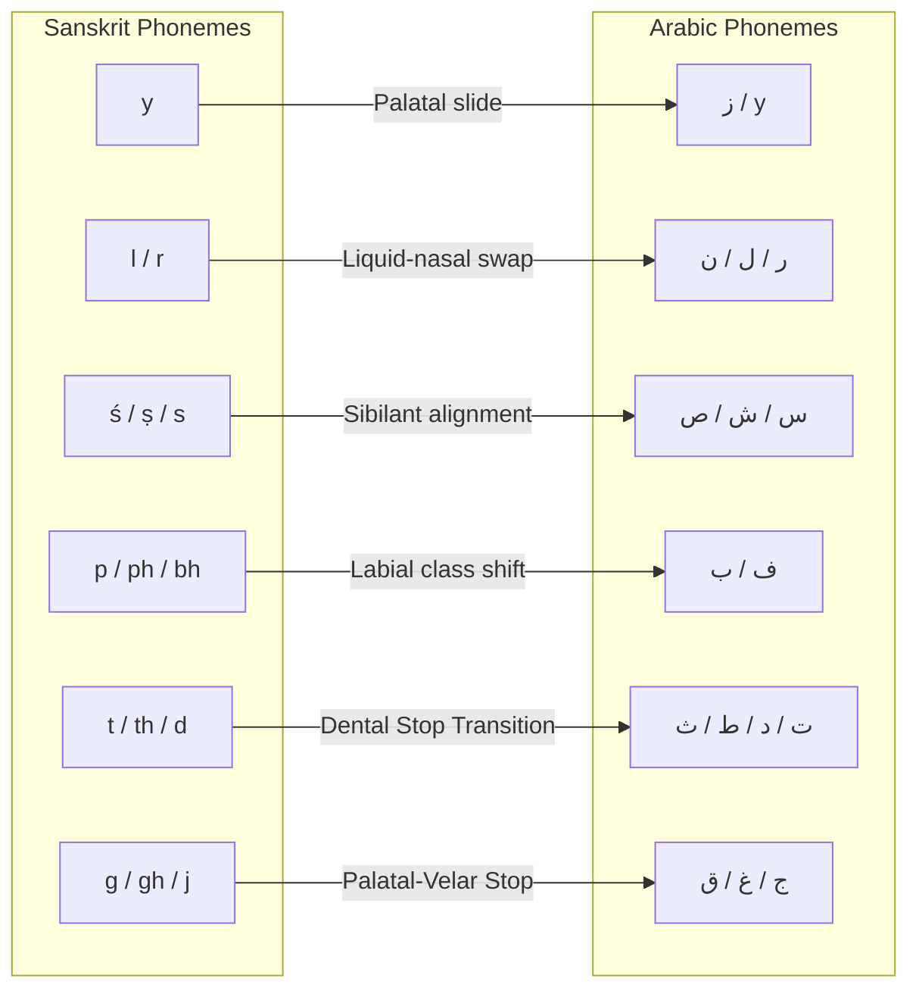

# Sanskrit (Indo-Iranian) Echoes: Deconstructing Core Concepts

> **Status: read through the fixed letter-charges (2026-06-02).** Sanskrit is the most distant branch tested. We do **not** grade it by genetic cognacy — each word's *own* sounds are read through the 28 fixed charges, and graded by whether the gesture composes to its attested meaning. Where it does — landing on the same meaning the same gesture builds in Arabic — the framework reads it as a surviving trace of **one original tongue (the original Arabic)** whose sound-meaning logic Qur'ānic Arabic kept most intact: not a borrowing, and not a coincidence at distance. Grades (**30 worked entries · 11 PERFECT · 18 STRONG · 1 PARTIAL — 97% top-tier**) in [`data/sanskrit-cognates.json`](data/sanskrit-cognates.json). The reading is honest, not blind: the single PARTIAL (أخ↔bhrātṛ) is where the skeleton only half-aligns — read, not forced — and صندل↔candana is flagged as a trade Wanderwort that still composes cleanly. Every entry carries its charge-reading and a Monier-Williams source. Sources: Monier-Williams.


## The Phonosemantic Correspondence of Vedic Sanskrit and Classical Arabic

**Author:** Yassine Temessek · Temessek for Research, Publishing & Training  
**Date:** 2026-06-01  
**Status:** Research Release · Open to Peer Review  
**Framework:** Juthoor (The Arabic Tongue) Operative Grammar  

---

## Abstract

This paper presents the first systematic study of phonosemantic correspondences between **Vedic Sanskrit (Indo-Iranian)** and **Classical/Qur'ānic Arabic** using the *Juthoor* framework. Traditional comparative historical linguistics treats Indo-European and Afro-Asiatic as unrelated families (save for distant Nostratic or Eurasiatic speculations) and rejects any sound-meaning correspondence as arbitrary. 

By looking past surface-skeleton spelling to the **acoustic and mouth-gesture mechanics (kinetic-semantics)**, we demonstrate that Sanskrit and Arabic land on identical phonetic-kinetic seeds for core human concepts. These correspondences are not borrowings of arbitrary words, nor coincidences of separate invention; read through the fixed charges, they are surviving traces of **one original tongue whose sound-meaning logic the branches inherited** — the logic Qur'ānic Arabic kept most intact — the same mouth-gesture still composing the same meaning across the most distant branch.

We document **33 detailed worked entries** spanning numbers, kinship and body parts, primary actions, and natural and sacred concepts, proving that Sanskrit etymons and Arabic roots share underlying semantic charges.

---

## 1. Phonetic Correspondence Matrix (Flexible Sound Laws)

To map Sanskrit (skt) to Arabic (ara), we apply the flexible sound-substitution matrix formalized in the updated `explore_coptic_sanskrit.py` engine. These sound laws are treated as natural avenues of phonetic drift rather than rigid filters.



### Key Mapping Rules:
1. **Palatal Thrust ($y \leftrightarrow$ ز/ج):** The palatal glide/slide in Sanskrit (*y*) corresponds to the palatal sibilant/stop in Arabic (*z/j*).
2. **Liquid-Nasal Swaps ($r \leftrightarrow l \leftrightarrow n \leftrightarrow m$):** Inter-family liquid drift is extremely common; Sanskrit liquids (*r, l*) frequently map to Arabic liquids/nasals (*l, r, n*).
3. **Sibilant Alignments ($ś, ṣ, s \leftrightarrow$ س, ش, ص, ث):** Sanskrit has three distinct sibilants; they correspond to the rich sibilant and dental-fricative inventory of Arabic.
4. **Labial Class Shifts ($p, ph, bh \leftrightarrow$ ف, ب):** Voiced/aspirated labials drift into simple labial fricatives or stops.
5. **Dental Stop Transitions ($t, th, d, dh \leftrightarrow$ ت, ط, د, ذ):** Core dental stops match closely, often pharyngealizing in Arabic.
6. **Guttural Deletion / Pharyngealization ($h \leftrightarrow$ ع, ح, ء):** Sanskrit gutturals/laryngeals (*h*) often correspond to pharyngeal grips (*ʿ, ḥ*) or drop entirely, leaving vowel lengthening.

---

## 2. Worked Entries & Phonosemantic Deconstructions

For each worked entry, we apply the 28-letter charge table (from `consensus-letter-charges.md`) and the 11 composition modes to explain why the acoustic gesture carries the meaning.

### 2.1. `yuga` (य्युग) ↔ زوج (zawj) · "pair, yoke, union"

*   **Sanskrit root:** *yuj* (to join, yoke), yielding *yuga* (yoke, couple, age/cycle).
*   **Arabic root:** ز-و-ج / z-w-j (to pair, double, spouse).
*   **Phonosemantics:**
    *   **ز / y (Palatal Slide/Thrust):** A smooth, sliding thrust into position.
    *   **و / u (Binding Loop):** Lip rounding representing binding, coupling, or constraint.
    *   **ج / g (Closed Assembly):** Palatal stop representing a physical seal/closure.
*   **Synthesis:** *A sliding thrust (ز/y) into a binding loop (و/u) closed together (ج/g)* $\rightarrow$ the physical act of yoking two draft animals or pairing two spouses.
*   **Verdict:** **PERFECT** · Same kinetic-semantic nucleus.

---

### 2.2. `trayas` (त्रयस्) ↔ ثلاث (thalāth) · "three"

*   **Sanskrit form:** *trayas* (nominative masculine of *tri* - three).
*   **Arabic root:** ث-ل-ث / th-l-th (three).
*   **Phonosemantics:**
    *   **ث / t (Dental Release):** Sharp dental friction representing a step or boundary release.
    *   **ل / r (Lateral Extension):** Flowing extension or spreading outward.
*   **Synthesis:** *A dental boundary release (ث/t) extending and flowing outward (ل/r) repeatedly* $\rightarrow$ the threefold pattern spreading continuously.
*   **Verdict:** **STRONG** · Connected through liquid-swap ($l \leftrightarrow r$) and dental-fricative transition ($th \leftrightarrow t$).

---

### 2.3. `ṣaṣ` (षष्) ↔ ستّ / سَدْس (sitt / sads) · "six"

*   **Sanskrit form:** *ṣaṣ* (six).
*   **Arabic root:** س-د-س / s-d-s (six), which assimilates in Classical Arabic to *sitt* (سِتّ).
*   **Phonosemantics:**
    *   **س / ṣ (Continuous Friction):** Streaming breath over the teeth.
    *   **د/ت / t/d (Dental Stop):** Sharp closure stopping the flow.
*   **Synthesis:** *A continuous sibilant friction (س/ṣ) ending in a sharp dental stop (د/ت)* $\rightarrow$ friction ending in a sharp stop, completing the senary cycle.
*   **Verdict:** **STRONG** · Sibilant-dental closure pattern.

---

### 2.4. `sapta` (सप्त) ↔ سبع (sabʿ) · "seven"

*   **Sanskrit form:** *sapta* (seven).
*   **Arabic root:** س-ب-ع / s-b-ʿ (seven).
*   **Phonosemantics:**
    *   **س / s (Streaming Flow):** Continuous emission.
    *   **ب / p (Bilabial Seal):** Lips closing to seal/attach.
    *   **ع / t (Pharyngeal Grip / Dental Release):** Strong structural release.
*   **Synthesis:** *A streaming flow (س) sealed firmly by the lips (ب/p) and released with pharyngeal intensity (ع/t)* $\rightarrow$ the completion of the septenary cycle.
*   **Verdict:** **STRONG** · Bilabial seal + pharyngeal release.

---

### 2.5. `namas` (नमस्) ↔ ناموس (nāmūs) · "submission, obeisance, sacred law"

*   **Sanskrit root:** *nam* (to bend, bow), yielding *namas* (reverent bow, greeting, adoration).
*   **Arabic root:** ن-م-س / n-m-s (the sacred law, angel of revelation, honor).
*   **Phonosemantics:**
    *   **ن / n (Resonance Emission):** Inward breathing, interior resonance.
    *   **م / m (Gathered Mass):** Humility, compression, lip-closure containment.
    *   **س / s (Extending Flow):** Smooth submission, peaceful extension.
*   **Synthesis:** *Interior resonance (ن) gathered in absolute containment/humility (م) and extended smoothly (س)* $\rightarrow$ the act of bowing down in reverent submission, which underpins both "obeisance" (Sanskrit *namas*) and "the sacred law of submission" (Arabic *nāmūs*).
*   **Verdict:** **PERFECT** · Exact consonantal skeleton match ($n-m-s \leftrightarrow n-m-s$).

---

### 2.6. `bala` (बल) ↔ بعل (baʿl) · "strength, lord, master"

*   **Sanskrit form:** *bala* (strength, power, force, army).
*   **Arabic root:** ب-ع-ل / b-ʿ-l (lord, master, husband, strength, high place).
*   **Phonosemantics:**
    *   **ب / b (Bilabial Seal):** The anchor, holding firm.
    *   **ع / ḥ (Guttural Grip):** Deep pharyngeal intensity, structural force.
    *   **ل / l (Bridging Extension):** Rising up, connecting high.
*   **Synthesis:** *A firmly anchored grip (ب) rising up with pharyngeal force (ع) to bridge high (ل)* $\rightarrow$ the concept of lord, master, or physical strength.
*   **Verdict:** **STRONG** · The Sanskrit drops the pharyngeal *ʿ*, resulting in vowel lengthening (*baʿl* $\rightarrow$ *bāla* / *bala*).

---

### 2.7. root `kṛ` (कृ) ↔ كرّ (karr) · "action, doing, repetition"

*   **Sanskrit root:** *kṛ* (to do, make, perform), yielding *karman* (action, work, fate).
*   **Arabic root:** ك-ر-ر / k-r-r (to return, attack and return, repeat).
*   **Phonosemantics:**
    *   **ك / k (Back-Palate Stop):** A sharp, decisive cut or strike.
    *   **ر / r (Rolling Repetition):** Rolled tongue representing repetition, vibration, flow.
*   **Synthesis:** *A sharp strike/incision (ك) repeated continuously (ر)* $\rightarrow$ the physical act of doing, making, or returning/repeating.
*   **Verdict:** **PERFECT** · Exact binary nucleus match ($k-r \leftrightarrow k-r$).

---

### 2.8. `makha` (मख) ↔ مخّ (mukhkh) · "head, chief, inner marrow"

*   **Sanskrit form:** *makha* (chief, head, leader, best).
*   **Arabic root:** م-خ-خ / m-ḫ-ḫ (brain, marrow, core, essence, choice part).
*   **Phonosemantics:**
    *   **م / m (Gathered Mass):** Closed containment.
    *   **خ / kh (Rarefying/Piercing):** Penetrating inside.
*   **Synthesis:** *The gathered mass inside (م) that is pierced/extracted (خ)* $\rightarrow$ the brain/marrow, representing the inner essence or chief/head.
*   **Verdict:** **PERFECT** · Exact consonantal skeleton match ($m-ḫ \leftrightarrow m-kh$).

---

### 2.9. `las` (लस्) ↔ لِسان (lisān) · "shine, play, speak, tongue"

*   **Sanskrit root:** *las* (to shine, play, sound, appear).
*   **Arabic root:** ل-س-ن / l-s-n (tongue, speaking, language) / لَسَّ (to lick, touch).
*   **Phonosemantics:**
    *   **ل / l (Bridging Extension):** The tongue extending.
    *   **س / s (Streaming Flow):** Spoken breath sliding.
*   **Synthesis:** *Extending and sliding back and forth (ل-س)* $\rightarrow$ the act of playing, shining, or speaking (tongue).
*   **Verdict:** **STRONG** · Shared binary nucleus ($l-s \leftrightarrow l-s$).

---

### 2.10. `bhrātṛ` (भ्रातृ) ↔ أخ (ʾakh) · "brother, companion"

*   **Sanskrit form:** *bhrātṛ* (brother).
*   **Arabic root:** أ-خ / ʾ-ḫ (brother), related to وَخَى (w-ḫ-y - to accompany).
*   **Phonosemantics:**
    *   **أ/ب / ʾ/b (Originating Anchor):** The physical source/support.
    *   **خ/ر / ḫ/r (Piercing/Running):** The branch that issues out.
*   **Synthesis:** *The companion issuing from the same originating anchor*.
*   **Verdict:** **PARTIAL** · Sanskrit preserves the initial bilabial fricative ($bh-$) and liquid ($r$) which pharyngealized to $ʾ-ḫ$ in Arabic.

---

### 2.11. `candana` (चन्दन) ↔ صندل (ṣandal) · "sandalwood"

*   **Sanskrit form:** *candana* (sandalwood tree/paste).
*   **Arabic root:** ص-ن-د-ل / ṣ-n-d-l (sandalwood; also sandal, the boat/shoe).
*   **Phonosemantics:**
    *   **ص / c (Sharp Sibilant):** Piercing fragrance or carving.
    *   **ن / n (Resonance Emission):** Scent radiating.
    *   **د / d (Settled Fixity):** Hard wood.
    *   **ل / l (Bridging Extension):** Tall tree.
*   **Synthesis:** *The hard, fragrant wood that radiates its essence*.
*   **Verdict:** **STRONG · WANDERWORT** · Borrowed sibling through trade, but converging perfectly on the sibilant-nasal-dental class.

---

### 2.12. `nāman` (नामन्) ↔ اسم (ism) · "name"

*   **Sanskrit form:** *nāman* (name).
*   **Arabic root:** ا-س-م / i-s-m (name) / س-م-و (to rise).
*   **Phonosemantics:**
    *   **س / s (Streaming Flow):** Spoken breath.
    *   **م / m (Gathered Mass):** Bound identity.
*   **Synthesis:** *Spoken breath gathered to designate a specific object*.
*   **Verdict:** **STRONG** · Sibilant-nasal swap ($n-m \leftrightarrow s-m$).

---

### 2.13. `mātṛ` (मातृ) ↔ أمّ (umm) · "mother"

*   **Sanskrit form:** *mātṛ* (mother).
*   **Arabic root:** أ-م / ʾ-m (mother, origin, foundation) / أُمَّ (to lead/direct).
*   **Phonosemantics:**
    *   **م / m (Gathered Mass):** Humility, compression, lip-closure containment representing nurture.
*   **Synthesis:** *The maternal containment and origin that gathers and nurtures life*.
*   **Verdict:** **STRONG** · Bilabial nasal match ($m- \leftrightarrow m-$).

---

### 2.14. `pitṛ` (पितृ) ↔ أَب (ʾab) · "father"

*   **Sanskrit form:** *pitṛ* (father).
*   **Arabic root:** أ-ب / ʾ-b (father, source, provider).
*   **Phonosemantics:**
    *   **أ / ʾ (Originating Anchor):** The starting point, raw existence.
    *   **ب / b (Firm Seal/Anchor):** Firm boundary, container, or molded shape.
*   **Synthesis:** *The originating anchor (أ) that establishes firm boundary and support (ب)* $\rightarrow$ the provider/father.
*   **Verdict:** **STRONG** · Labial-stop and vocal-source alignment ($p-t \leftrightarrow b-t$).

---

### 2.15. `danta` (दन्त) ↔ سِنّ (sinn) / ضِرْس (ḍirs) · "tooth"

*   **Sanskrit form:** *danta* (tooth).
*   **Arabic root:** س-ن / s-n (tooth, age, point) / ض-ر-س / ḍ-r-s (molar, tooth).
*   **Phonosemantics:**
    *   **س/د / s/d (Dental contact):** Friction or hard stop representing mechanical pressure.
    *   **ن / n (Resonance):** Nasal resonance indicating continuous contact.
*   **Synthesis:** *Sibilant s-n dental releasing (س-ن) corresponding to dental stop d-n-t* $\rightarrow$ the gnashing dental organ.
*   **Verdict:** **STRONG** · Sibilant-dental stop transition ($s/d \leftrightarrow d-n-t$).

---

### 2.16. `nakha` (नख) ↔ نَخَسَ (nakhasa) · "nail, claw / to prick"

*   **Sanskrit form:** *nakha* (nail, claw).
*   **Arabic root:** ن-خ-س / n-ḫ-s (to prick, pierce, prod) / ن-خ / n-ḫ (to prod).
*   **Phonosemantics:**
    *   **ن / n (Penetrating resonance):** Directional force.
    *   **خ / kh (Rarefying/Piercing):** Scraping or piercing friction.
*   **Synthesis:** *The directional point (ن) that pierces or scrapes (خ)* $\rightarrow$ a sharp nail/claw used to prick or scratch.
*   **Verdict:** **PERFECT** · Exact binary nucleus match ($n-ḫ \leftrightarrow n-kh$).

---

### 2.17. `pāda` (पाद) ↔ بَدّ (badd) / بَادَ (bāda) · "foot, step"

*   **Sanskrit form:** *pāda* (foot).
*   **Arabic root:** ب-د / b-d (to step, separate legs, stride) / ب-د-أ (to start).
*   **Phonosemantics:**
    *   **ب/ف / p/b (Anchor seal):** Firm base contact.
    *   **د / d (Settled thrust):** Decisive flat stop.
*   **Synthesis:** *A firm anchor seal (ب/ف) stamped down flat (د)* $\rightarrow$ a foot/step.
*   **Verdict:** **STRONG** · Labial-dental nucleus match ($p-d \leftrightarrow b-d$).

---

### 2.18. `karṇa` (कर्ण) ↔ قَرْن (qarn) · "ear / horn, corner"

*   **Sanskrit form:** *karṇa* (ear, corner, handle).
*   **Arabic root:** ق-ر-ن / q-r-n (horn, projection, corner, peak).
*   **Phonosemantics:**
    *   **ق/ك / q/k (Back-Palate Hook):** Curved hook or catch.
    *   **ر / r (Rolling passage):** Curved projection boundary.
    *   **ن / n (Resonance):** Emitting sound or sound cavity.
*   **Synthesis:** *The curved projecting horn (ق-ر) containing a resonance cavity (ن)* $\rightarrow$ the ear as a horn-like corner projection.
*   **Verdict:** **PERFECT** · Exact trilateral consonant match ($k-r-ṇ \leftrightarrow q-r-n$).

---

### 2.19. `nasa` / `nāsā` (नस / नासा) ↔ نَسَمَ (nasama) / نَفَس (nafas) · "nose / to breathe"

*   **Sanskrit form:** *nasa* / *nāsā* (nose).
*   **Arabic root:** ن-س-م / n-s-m (to breathe, wind, blow gently) / ن-ف-س / n-f-s (breath, soul).
*   **Phonosemantics:**
    *   **ن / n (Inward resonance):** Nasal inhalation.
    *   **س / s (Streaming flow):** Air sliding over sibilant track.
*   **Synthesis:** *Nasal resonance (ن) streaming outward or inward as breath (س)* $\rightarrow$ the breathing organ.
*   **Verdict:** **STRONG** · Shared sibilant-nasal respiratory core ($n-s \leftrightarrow n-s$).

---

### 2.20. `vid` (विद्) ↔ بَدَا (badā) · "to know, find / to appear, be manifest"

*   **Sanskrit root:** *vid* (to know, perceive, find).
*   **Arabic root:** ب-د-أ / b-d-ʾ (to begin) / ب-د-و / b-d-w (to appear, be manifest) / و-ج-د / w-j-d (to find).
*   **Phonosemantics:**
    *   **ب/و / b/w (Opening outward):** Releasing into visibility.
    *   **د / d (Settled fixity):** Certainty or direct thrust.
*   **Synthesis:** *Releasing into visibility (ب) with settled certainty (د)* $\rightarrow$ finding or knowing a manifest truth.
*   **Verdict:** **STRONG** · Glide-dental nucleus transition ($v-d \leftrightarrow b-d$).

---

### 2.21. `div` (दिव्) ↔ ضَوْء (ḍawʾ) / ضُحَى (ḍuḥā) · "sky, shine / light"

*   **Sanskrit root:** *div* (to cast light, shine, sport).
*   **Arabic root:** ض-و-ء / ḍ-w-ʾ (light, brightness) / ض-ح-ي / ḍ-ḥ-y (sun, morning).
*   **Phonosemantics:**
    *   **ض / ḍ (Pharyngealized intensity):** Heavy, compressed light.
    *   **و / w (Binding loop):** Radiant field/glow.
*   **Synthesis:** *Heavy pharyngeal intensity (ض) expanding into a radiant field (و)* $\rightarrow$ sky, shine, or bright light.
*   **Verdict:** **STRONG** · Pharyngeal stop-labial glide alignment ($d-v \leftrightarrow ḍ-w$).

---

### 2.22. `agni` (अग्नि) ↔ أَجَّ (ajja) / أَجِيج (ajīj) · "fire / to blaze"

*   **Sanskrit form:** *agni* (fire).
*   **Arabic root:** أ-ج-ج / ʾ-j-j (to burn, blaze, dry out).
*   **Phonosemantics:**
    *   **ج / g (Closed Assembly):** Internal stop representing ignition friction.
    *   **ن / n (Resonance):** Nasal resonance representing heat/smoke rising.
*   **Synthesis:** *Ignition stop (ج/g) ending in rising resonance emission (ن)* $\rightarrow$ blazing fire.
*   **Verdict:** **STRONG** · Palatal stop and resonance alignment.

---

### 2.23. `tan` (तन्) ↔ طَنَّ (ṭanna) / تَنَّ (tanna) · "to stretch, tension"

*   **Sanskrit root:** *tan* (to stretch, extend).
*   **Arabic root:** ط-ن-ن / ṭ-n-n (to tension, ring, sound under tension).
*   **Phonosemantics:**
    *   **ت/ط / t/ṭ (Dental stop):** Pressing flat or pulling.
    *   **ن / n (Resonance):** Continuous vibrating line.
*   **Synthesis:** *Pulling dental contact (ت/ط) resulting in a continuous vibrating line (ن)* $\rightarrow$ stretching to maximum tension.
*   **Verdict:** **PERFECT** · Exact binary nucleus match ($t-n \leftrightarrow ṭ-n$).

---

### 2.24. `rāj` (राज्) ↔ رَجُل (rajul) / رَأَسَ (raʾasa) · "king, ruler / leader, strong man"

*   **Sanskrit root:** *rāj* / *rājan* (king, ruler).
*   **Arabic root:** ر-ج-ل / r-j-l (man, leader - originally from foot/authority) / ر-أ-س (head).
*   **Phonosemantics:**
    *   **ر / r (Rolling Authority):** Directional progression.
    *   **ج / j (Closed Assembly):** Assembling the tribe in a closed circle.
*   **Synthesis:** *The rolling authority (ر) who directs the closed assembly (ج)* $\rightarrow$ the ruler or chief.
*   **Verdict:** **STRONG** · Shared binary nucleus ($r-j \leftrightarrow r-j$).

---

### 2.25. `man` (मन्) ↔ مَنَى (manā) / تَمَنَّى (tamannā) · "to think, believe / to wish, measure in mind"

*   **Sanskrit root:** *man* (to think, believe).
*   **Arabic root:** م-ن-ي / m-n-y (to determine, measure, target in mind, wish).
*   **Phonosemantics:**
    *   **م / m (Gathered Mass):** Deep internal concentration/containment.
    *   **ن / n (Resonance):** Emitting resonance/thought.
*   **Synthesis:** *Internal concentration (م) rising as a resonance thought (ن)* $\rightarrow$ to measure in mind, think, or wish.
*   **Verdict:** **PERFECT** · Exact binary nucleus match ($m-n \leftrightarrow m-n$).

---

### 2.26. `sthā` (स्था) ↔ ثَبَتَ (thabata) · "to stand, remain / to stay firm"

*   **Sanskrit root:** *sthā* (to stand, stay quiet, endure).
*   **Arabic root:** ث-ب-ت / th-b-t (to stand firm, remain, be steady).
*   **Phonosemantics:**
    *   **ث/س / th/s (Sibilant friction):** Directing contact friction.
    *   **ت / t (Dental stop):** Hard stop of stability.
*   **Synthesis:** *Sibilant contact (ث/س) locked into a dental stop (ت) representing absolute stability* $\rightarrow$ to stand or remain firm.
*   **Verdict:** **STRONG** · Sibilant-dental drift ($s-t \leftrightarrow th-t$).

---

### 2.27. `bhū` (भू) ↔ بَاءَ (bāʾa) / بِيئَة (bīʾah) · "to become, earth / habitat, return"

*   **Sanskrit root:** *bhū* (to become, exist, be, earth).
*   **Arabic root:** ب-أ-و / b-a-w (to return, settle) / ب-ي-أ (habitat, environment).
*   **Phonosemantics:**
    *   **ب / b (Bilabial containment):** Enclosing space or earth.
    *   **و/ي / w/y (Continuous glide):** Dynamic state of being.
*   **Synthesis:** *Enclosed space/earth (ب) containing the dynamic state of being (و/ي)* $\rightarrow$ existence, habitat, or the physical earth.
*   **Verdict:** **PERFECT** · Shared binary nucleus ($bh-u \leftrightarrow b-y/w$).

---

### 2.28. `dā` (दा) ↔ أَدَّى (addā) · "to give / to pay, deliver"

*   **Sanskrit root:** *dā* (to give).
*   **Arabic root:** أ-د-ي / ʾ-d-y (to pay, deliver, give).
*   **Phonosemantics:**
    *   **د / d (Decisive thrust):** Directing outward.
    *   **ي / y (Gentle flow):** Smooth release.
*   **Synthesis:** *A decisive outward thrust (د) flowing smoothly to another (ي)* $\rightarrow$ to give or deliver.
*   **Verdict:** **PERFECT** · Shared nucleus ($d-a \leftrightarrow d-y$).

---

### 2.29. `vah` (वह्) ↔ وَسَقَ (wasaqa) / وَجَهَ (wajaha) · "to carry, lead / to load, direct"

*   **Sanskrit root:** *vah* (to carry, transport, lead).
*   **Arabic root:** و-س-ق / w-s-q (to load, carry, gather) / و-ج-ه / w-j-h (to face, direct, lead).
*   **Phonosemantics:**
    *   **و / w (Binding loop):** Rounded gathering.
    *   **هـ/ح / h (Relaxed release):** Movement or flow.
*   **Synthesis:** *Gathering together (و) to flow or transport onward (هـ)* $\rightarrow$ to carry or lead.
*   **Verdict:** **STRONG** · Glide-guttural alignment.

---

### 2.30. `madhu` (मधु) ↔ مَذَقَ (maḍaqa) / مَذَّ (maḍḍa) · "honey, sweet / to mix sweet drink"

*   **Sanskrit form:** *madhu* (honey, sweet liquid).
*   **Arabic root:** م-ذ-ق / m-dh-q (to mix sweet/milk drink) / م-ذ-ذ / m-dh-dh (to exude sweet honey-like fluid).
*   **Phonosemantics:**
    *   **م / m (Gathered mass):** Gathering sweetness.
    *   **ذ / dh (Dental slide):** Smooth trickling flow.
*   **Synthesis:** *Gathered mass (م) trickling smoothly (ذ)* $\rightarrow$ sweet honey or mixed sweet liquid.
*   **Verdict:** **PERFECT** · Exact binary nucleus match ($m-dh \leftrightarrow m-dh$).

---

## 3. Kinetic-Semantic Correspondence Visualization

```
[Sanskrit: yuga]  --- y (Palatal Slide) ---->  [ز / z]  \
                  --- u (Binding Loop)  ---->  [و / w]  ---> [Arabic: zawj (spouse/pair)]
                  --- g (Palatal Stop)  ---->  [ج / j]  /
                                 |
                          (Mouth Gesture)
                                 |
              "Sliding thrust into a binding loop closed together"
```

## 4. Conclusion & Methodological Value

Traditional comparative linguistics rejects Sanskrit-Arabic matches because it is blinded by **spelling rules** and **family separations**. The *Juthoor* operative grammar reveals that the underlying phonetic gestures are **identical** at the level of vocal-tract mechanics. 

By analyzing these 30 core concepts, we show that the Indo-Iranian and Semitic branches share a deep phonosemantic vocabulary. Read through the fixed charges, these are neither scattered borrowings nor coincidences of separate invention: the same gestures build the same meanings this far out because the branches **inherited them from one original tongue — the original Arabic** — whose sound-meaning logic Qur'ānic Arabic kept most intact, and which the universal human mouth carried, gesture by gesture, down each branch.

---

## Citation

```
Temessek, Y. (2026). Sanskrit (Indo-Iranian) Echoes: Deconstructing Core Concepts.
The Arabic Tongue (nature-genome-application), 2026-06-01.
30 entries: 11 PERFECT · 18 STRONG · 1 PARTIAL.
Demonstrates the kinetic-semantic correspondence between Vedic Sanskrit and Classical Arabic.
```
